<h2><center>Database System</center></h2>
<h1><center>实验2  SQL数据定义和操作</center></h1>
<center>王傲哲 3220105775</center>

### 实验目的：
1. 掌握关系数据库语言SQL的使用。
2. 面向某个应用场景定义数据模式和操作数据。

### 实验平台：
* MySQL

### 实验内容：
1. 以某个应用场景（如Banking）为例，建立数据库。
2. 数据定义：表的建立、删除；索引的建立、删除；视图的建立、删除。
3. 数据更新：用insert/delete/update语句插入/删除/更新表数据。
4. 数据查询：单表查询、多表查询、嵌套子查询等。
5. 视图操作：通过视图进行数据查询和数据更新。

### 实验步骤：
#### 1. 建立数据库
```sql
CREATE DATABASE `BANK`;
```
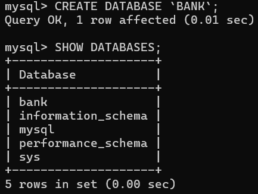

#### 2. 数据定义
##### 2.1.1 表的建立
```sql
CREATE TABLE branch (
	branch_name VARCHAR(20) NOT NULL,
	branch_city VARCHAR(20),
	assets INT,
	PRIMARY KEY (branch_name)
);
```
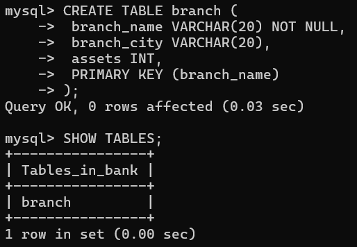

##### 2.1.2 添加字段
```sql
ALTER TABLE account ADD branch_name VARCHAR(20);
```

##### 2.1.3 修改数据类型
```sql
ALTER TABLE account MODIFY account_id VARCHAR(20);
```

##### 2.1.4 修改字段名和类型
```sql
ALTER TABLE account CHANGE username customer_name VARCHAR(20);
```

##### 2.1.5 删除字段
```sql
ALTER TABLE customer DROP branch_name;
```
##### 2.1.6 修改表名
```sql
ALTER TABLE branch RENAME TO branches;
```

##### 2.1.7 表的删除
```sql
DROP TABLE branch;
```
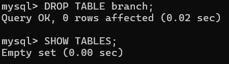

##### 2.2.1 索引的建立
* 创建表的同时建立索引
```sql
CREATE TABLE branch (
	branch_name VARCHAR(20) NOT NULL,
	branch_city VARCHAR(20),
	assets INT,
	PRIMARY KEY (branch_name),
	INDEX index_name(branch_name)
);
```
* 为已存在的表建立索引（以下两种方法均可）
```sql
ALTER TABLE branch ADD INDEX index_name(branch_name);
```
```sql
CREATE INDEX index_name ON branch(branch_name);
```
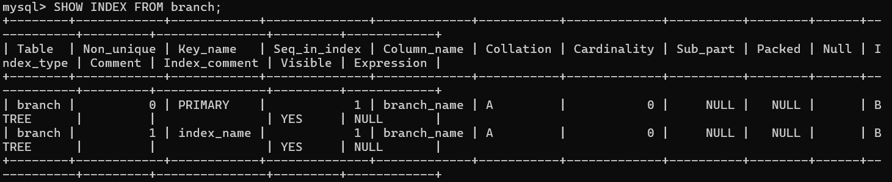

##### 2.2.2 索引的删除
（以下两种方法均可）
```sql
DROP INDEX index_name on branch;
```
```sql
ALTER TABLE branch DROP INDEX index_name;
```

##### 2.3.1 视图的建立
```sql
CREATE VIEW view_branch AS SELECT branch_name FROM branch WHERE branch_city='BOSTON';
```
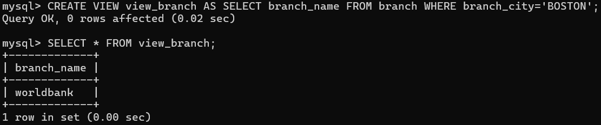

##### 2.3.2 视图的删除
```sql
DROP VIEW view_branch;
```

#### 3. 数据更新
##### 3.1 插入数据
* 给所有字段插入数据
```sql
INSERT INTO branch VALUES ('hellobank', 'Boston', 10000);
```

* 给指定字段插入数据
```sql
INSERT INTO branch (branch_name, assets) VALUES ('worldbank', 10000);
```

##### 3.2 删除数据
```sql
DELETE FROM branch WHERE branch_name='worldbank';
```

##### 3.3 更新数据
```sql
UPDATE branch SET assets=20000 WHERE branch_city='Boston';
```
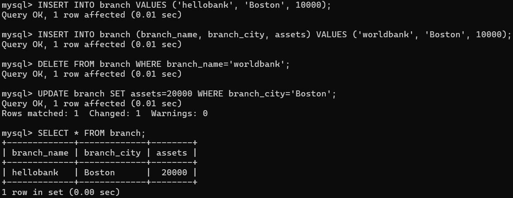

#### 4. 数据查询
##### 4.1 单表查询
```sql
SELECT * FROM customer;
```
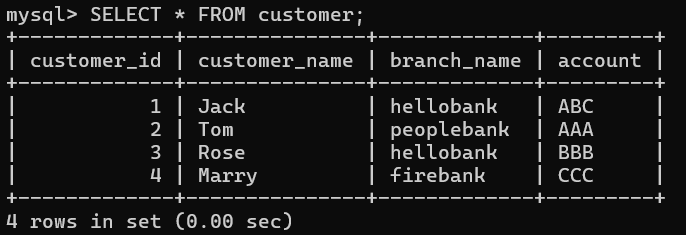

##### 4.2 多表查询
##### 4.2.1 内连接查询
查询结果为交集的拼接
* 显式
```sql
SELECT * FROM branch INNER JOIN customer ON branch.branch_name=customer.branch_name;
```

* 隐式
```sql
SELECT * FROM branch, customer WHERE branch.branch_name=customer.branch_name;
```
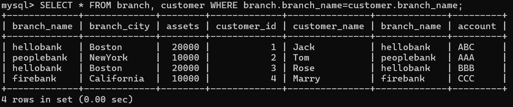

##### 4.2.2 外连接查询
* 左外连接
查询结果为customer的所有数据 + account中对应的数据
```sql
SELECT * FROM customer LEFT OUTER JOIN account ON customer.customer_id=account.customer_id;
```
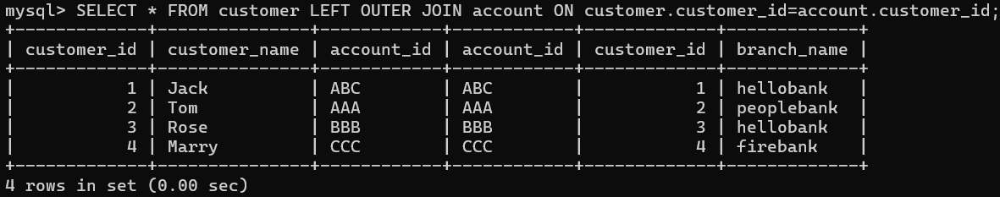

* 右外连接
查询结果为account的所有数据 + customer中对应的数据
```sql
SELECT * FROM account RIGHT OUTER JOIN customer ON account.customer_id=customer.customer_id;
```
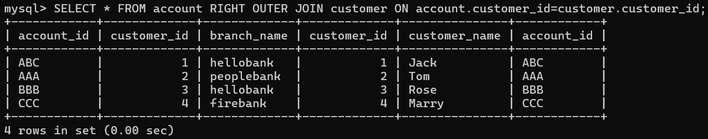

##### 4.2.3 自连接查询
（自连接必须给表取别名，如下取a，b）
在所有职员表emp中查询基层员工及其所属领导的名字，查询结果为基层员工名字 + 所属领导名字
```sql
SELECT a.name b.name FROM emp a JOIN emp b ON a.manager_id=b.emp_id;
```

##### 4.2.4 联合查询
查询结果为多次查询结果的合并结果集
```sql
SELECT * FROM branch WHERE assets=10000
UNION [ALL]
SELECT * FROM branch WHERE branch_city='Boston';
```
（UNION ALL将全部查询数据直接合并；UNION将对合并后的数据去重）

##### 4.3 嵌套子查询
##### 4.3.1 标量子查询：子查询结果为单个值
* 常用查询符号：=、>、<、<>(!=)、>=、<= 
```sql
SELECT * FROM branch WHERE branch_name = (SELECT branch_name FROM customer WHERE customer_id=1);
```
(查询id为1的用户已开过户的银行信息)
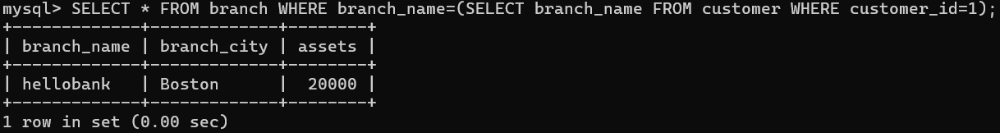

##### 4.3.2 列子查询：子查询结果为单列
* 常用查询符号：
  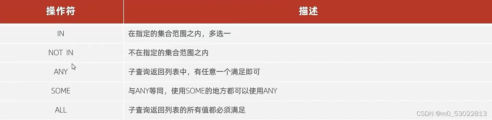
```sql
SELECT * FROM account WHERE branch_name in (SELECT branch_name FROM branch WHERE assets=10000);
```
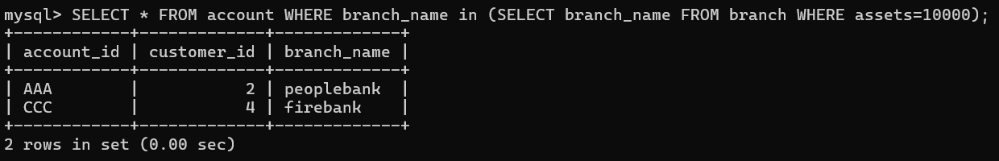

##### 4.3.3 行子查询：子查询结果为单行
* 常用查询符号：=、<>、IN、NOT IN
```sql
SELECT * FROM customer WHERE (customer_id, account_id) = (SELECT customer_id, account_id FROM account WHERE branch_name='peoplebank');
```
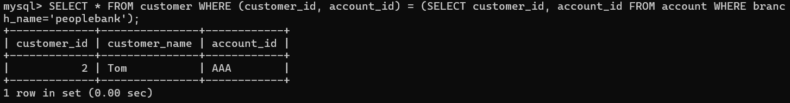

##### 4.3.4 表子查询：子查询结果为多行多列
* 常用查询符号：IN
```sql
SELECT * FROM account WHERE (branch_name, customer_id) IN (SELECT branch_name, customer_id FROM (SELECT * FROM branch WHERE assets=10000) AS a INNER JOIN (SELECT * FROM customer where deposit=10000) AS b WHERE a.branch_city=b.customer_city);
```
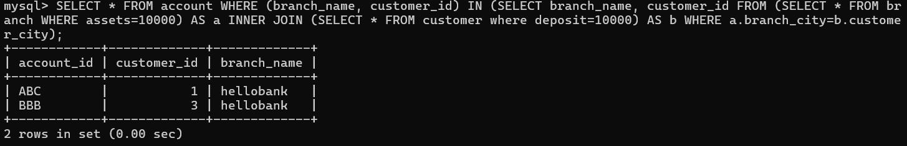

#### 5. 视图操作
##### 5.1 数据查询
在左侧SCHEMA中找到待查询的表，右键后点击Select Rows 
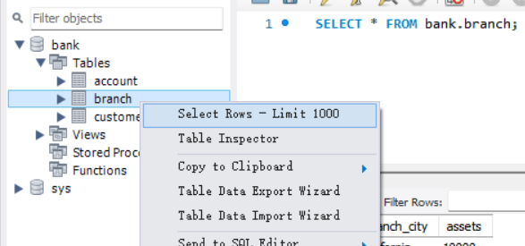

即可显示该表视图
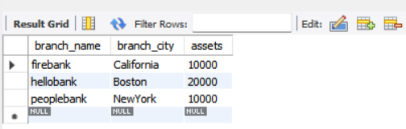

##### 5.2 数据更新
* 编辑表中字段（列）：
在左侧SCHEMA中找到目标表，右键后点击Alter Table
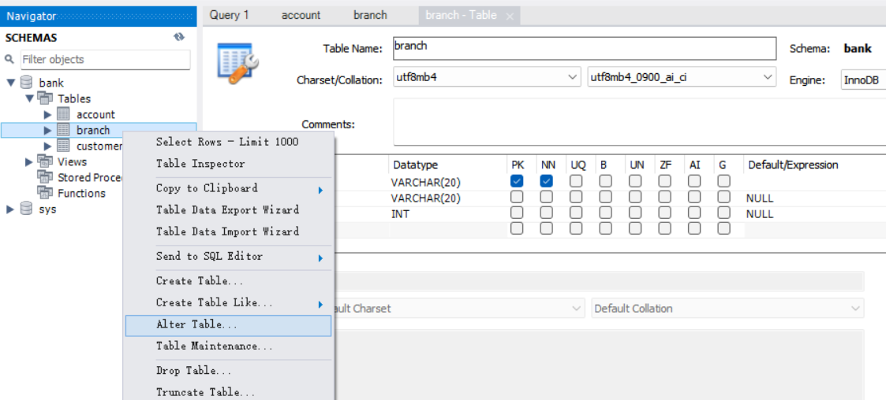

* 编辑表中数据（行）：
直接点击待更新的数据即可进行修改，或点击右上角的Edit按钮亦可依次完成编辑现有数据、插入新数据、删除数据
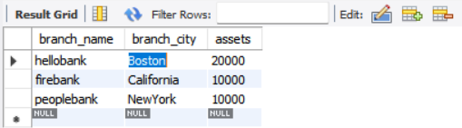