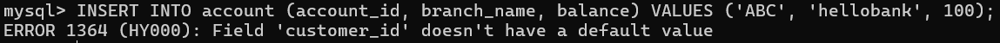
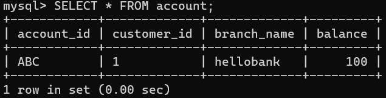
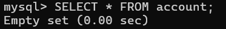
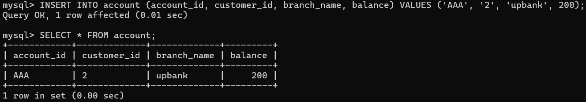
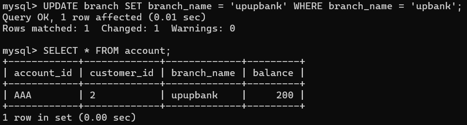
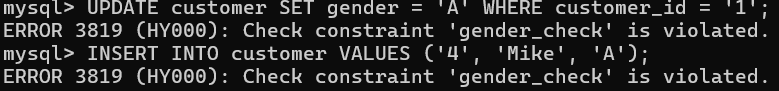
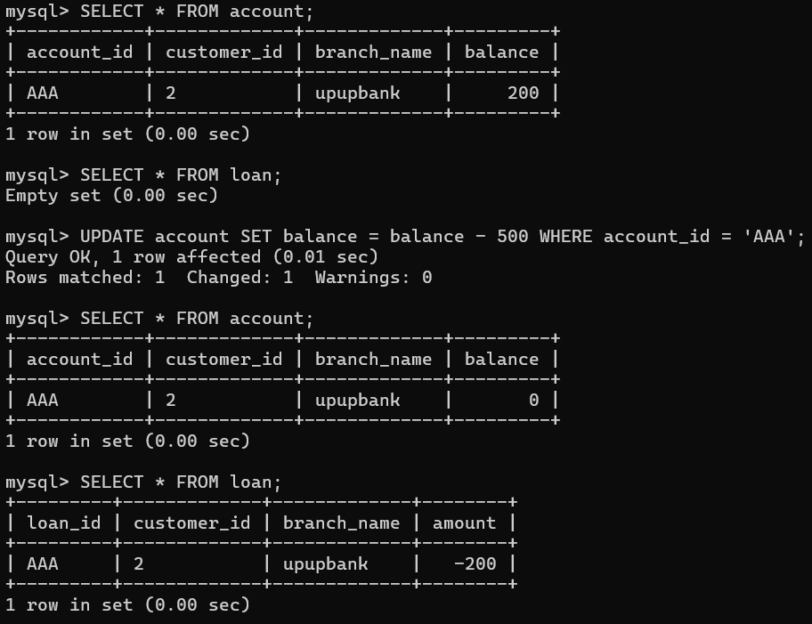

<h2><center>Database System</center></h2>
<h1><center>实验3  SQL数据完整性</center></h1>
<center>王傲哲 3220105775</center>

### 实验目的：
* 熟悉通过SQL进行数据完整性控制的方法。

### 实验平台：
* MySQL

### 实验内容：
1. 定义若干表，其中包括primary key, foreign key 和check的定义。
2. 表中插入数据，考察primary key如何控制实体完整性。
3. 删除被引用表中的行，考察foreign key中on delete子句如何控制参照完整性。
4. 修改被引用表中的行的primary key，考察foreign key中on update子句如何控制参照完整性。
5. 修改或插入表中数据，考察check子句如何控制校验完整性。
6. 定义一个trigger,并通过修改表中数据考察触发器如何起作用。

### 实验步骤：
#### 1. 建表
```sql
CREATE TABLE customer (
	customer_id VARCHAR(20),
	customer_name VARCHAR(20),
	gender VARCHAR(1),
	PRIMARY KEY (customer_id),
	CONSTRAINT gender_check CHECK (gender in ('M', 'F'))
);

CREATE TABLE account (
	account_id VARCHAR(20),
	customer_id VARCHAR(20),
	branch_name VARCHAR(20),
	balance INT,
	PRIMARY KEY (account_id, customer_id),
	FOREIGN KEY (branch_name) REFERENCES branch(branch_name)
		ON DELETE CASCADE
        ON UPDATE CASCADE
);

CREATE TABLE loan (
	loan_id VARCHAR(20),
	customer_id VARCHAR(20),
	branch_name VARCHAR(20),
	amount INT,
	PRIMARY KEY (loan_id, customer_id),
	FOREIGN KEY (branch_name) REFERENCES branch(branch_name)
		ON DELETE CASCADE
        ON UPDATE CASCADE
);
```

#### 2. 插入数据，考察PRIMARY KEY对实体完整性的控制
```sql
INSERT INTO account (account_id, branch_name, balance) VALUES ('ABC', 'hellobank', 100);
```

插入失败，可知插入数据时PRIMARY KEY不可为空或不设置值，正确做法如下
```sql
INSERT INTO account (account_id, customer_id, branch_name, balance) VALUES ('ABC', '1', 'hellobank', 100);
```


#### 3. 删除被引用表中的行，考察ON DELETE子句对参照完整性的控制
```sql
DELETE FROM branch WHERE branch_name = 'hellobank';
```

可知刚刚插入到account表中且参照branch表中branch_name = 'hellobank'的银行的数据，随着branch表中名为'hellobank'的银行的数据的删除也随之在account表中级联删除。

#### 4. 修改被引用表中的行的PRIMARY KEY，考察FOREIGN KEY中ON UPDATE子句对参照完整性的控制
```sql
UPDATE branch SET branch_name = 'upupbank' WHERE branch_name = 'upbank';
```
 
可知被引用表branch中一行的branch_name(PRIMARY KEY)由'upbank'修改为'upupbank'后，account表中参照branch中'upbank'的数据的branch_name也随之级联更新为'upupbank'。

#### 5. 修改或插入表中数据，考察CHECK子句对校验完整性的控制
```sql
UPDATE customer SET gender = 'A' WHERE customer_id = '1';

INSERT INTO customer VALUES ('4', 'Mike', 'A');
```

由于CHECK子句设置customer表中属性gender只能为'M'或'F'，任何违反此完整性的修改或插入都会被阻止。

#### 6. 定义TRRIGER，修改表中数据
```sql
DELIMITER $
CREATE TRIGGER balance_trigger BEFORE UPDATE ON account FOR EACH ROW
    IF (NEW.balance < 0) THEN
      		BEGIN
      			INSERT INTO loan
      				(SELECT * FROM account WHERE account_id = NEW.account_id);
      			UPDATE loan SET amount = -amount WHERE loan_id = NEW.account_id;
      			SET NEW.balance = 0;
      		END;
	END IF$
DELIMITER ;

UPDATE account SET balance = balance - 500 WHERE account_id = 'AAA';
```

可知当更新account表中某一用户的数据导致其余额小于0时会执行触发器，使得loan表中增加一行数据，欠款数额与此时余额的绝对值相等，最后将account表中该行数据的余额设置为0。

* BEFORE与AFTER区别：
BEFORE：(INSERT、UPDATE)可以对NEW进行修改，AFTER不能对NEW进行修改，两者都不能修改OLD数据。
对于INSERT语句, 只有NEW合法；
对于DELETE语句，只有OLD合法；
对于UPDATE语句，NEW、OLD可以同时使用。
