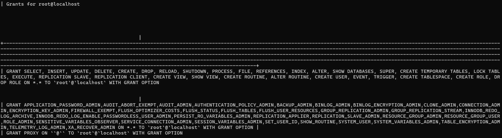
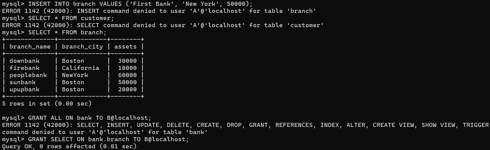
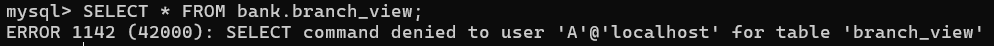
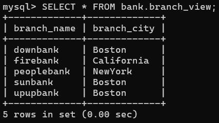

<h2><center>Database System</center></h2>
<h1><center>实验4  SQL安全性</center></h1>
<center>王傲哲 3220105775</center>

### 实验目的：
*  熟悉通过SQL进行安全性控制的方法。

### 实验平台：
* MySQL

### 实验内容：
1. 建立表，考察表的生成者拥有该表的哪些权限。
2. 使用SQL的grant和revoke命令对其他用户进行授权和权力回收，考察相应的作用。
3. 建立视图，并把该视图的查询权限授予其他用户，考察通过视图进行权限控制的作用。

### 实验步骤：
#### 1. 查询表的生成者对该表的权限
```sql
SHOW GRANTS;
```


#### 2. 授权与收权
##### 2.1 创建用户
```sql
CREATE USER 'A'@'localhost' IDENTIFIED BY '123456';
```

##### 2.2 授权
```sql
GRANT SELECT ON bank.branch TO A@localhost WITH GRANT OPTION;
```

##### 2.3 切换用户
```sql
eixt
mysql -u A -p
```

##### 2.4 权限尝试
```sql
INSERT INTO branch VALUES('First Bank', 'New York', 50000);
SELECT * FROM customer;
SELECT * FROM branch;
```

* 可见只有被授予的权限可以被执行，即`SELECT * FROM bank.branch`与该权限的管理。

##### 2.5 收回权限
```sql
REVOKE ALL ON bank.branch FROM A@localhost;
```
* （句末加入`RESTRICT`可防止级联收回）

#### 3. 视图的权限
##### 3.1 创建视图
```sql
CREATE VIEW branch_view AS
	SELECT branch_name, branch_city
	FROM branch;
```
（在root的用户身份下创建）

##### 3.2 授权前查询
```sql
SELECT * FROM bank.branch_view;
```
（在A的用户下查询）


##### 3.2 授权后查询
```sql
SELECT * FROM bank.branch_view;
```
（在A的用户下查询）
