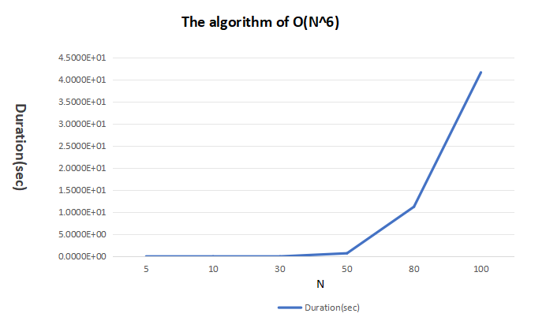
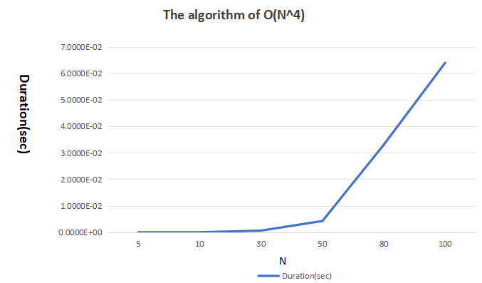
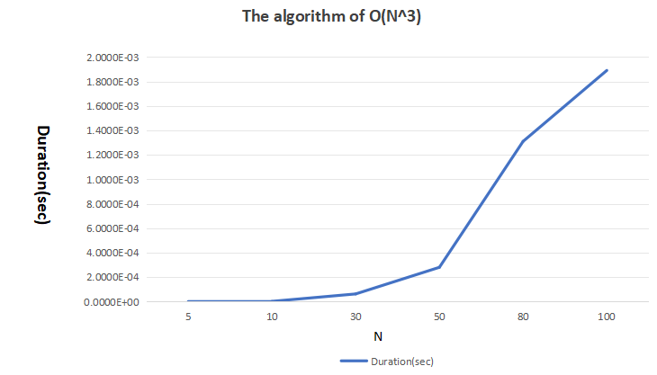
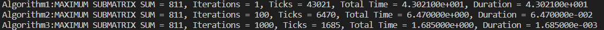
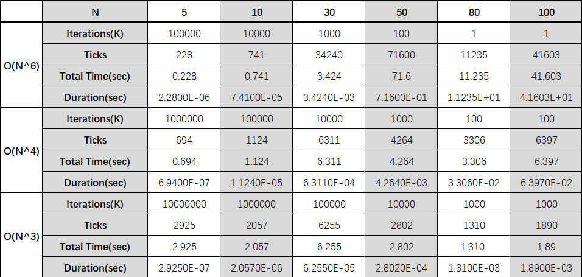
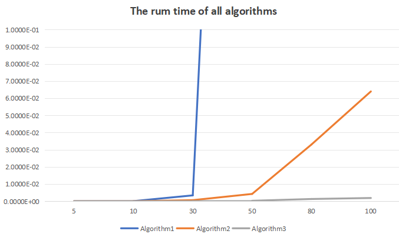

<br/>
<br/> 
<br/>
<br/> 
<br/>
<br/> 

# <center>MAXIMUM SUBMATRIX SUM</center>
<br/>

### <center>王傲哲</center>
<br/>

##### <center>Date:2023-10-05</center>
<div STYLE="page-break-after: always;"></div>

## **Chapter 1:    Introduction**

* ### Problem Discription
> Given a **N*N** matrix of integers, find the **maximum** sum of elements of the submatrix. If all elements of the matrix are **negative**, then by default the maximum sum of elements of the submatrix is **0**.
* ### Algorithm Introduction
> Prefix Sum Algorithm: Prefix Sum is a new array obtained by accumulating the elements one by one, starting from the first element of the array, where each element represents the cumulative sum of the original array from the beginning to the current position. Its main advantage is that it can answer the interval summing problem in O(1) time complexity without recalculating the interval sum every time. This is very useful in cases where the question requires frequent queries for the cumulative sum.
>
> Online Algorithm: This algorithm processes the input data one by one and generates the output on the fly without knowing the full content of the input in advance. This algorithm is typically used for efficient real-time decision making or processing in an uninterrupted stream of data input.
***

## **Chapter 2:    Algorithm Specification**
* ### Algorithm 1:O(N^6)
    > Iterate through each element of the matrix as the upper-left corner element of the submatrix, using that element as a starting point, and then iterate through all the elements to its lower right as the lower-right corner element of the submatrix. After determining the upper-left and lower-right corners, traverse all elements in between to obtain the sum of each submatrix element.

    #### Pseudo Code
    ```
    function sum_N6(a[][]):
        maxsum = 0
        for i from 0 to N-1:
            for j from 0 to N-1:
                for p from i to N-1:
                    for q from j to N-1:
                        sum = 0
                        for m from i to p:
                            for n from j to q:
                                sum += a[m][n]
                        if sum > maxsum:
                            maxsum = sum
        return maxsum
    ```

<br/>

* ### Algorithm 2:O(N^4)
    > Similar to the idea in Algorithm 1 to first determine the upper left and lower right corners of the submatrix, but in the process of summing the elements of the submatrix is no longer re-traversing all the elements in between, but borrowing the two-dimensional prefix sum to directly derive the sum of all the elements in the matrix with [i][j] as the upper-left corner and [p][q] as the lower-right corner.
    #### Pseudo Code
    ```
    function sum_N4(a[][]):
    maxsum = 0
    dp[N][N] = {0}
    for i from 0 to N-1:
        for j from 0 to N-1:
            if i == 0 and j == 0:
                dp[i][j] = a[i][j]
            else if i == 0:
                dp[i][j] = dp[i][j-1] + a[i][j]
            else if j == 0:
                dp[i][j] = dp[i-1][j] + a[i][j]
            else:
                dp[i][j] = dp[i-1][j] + dp[i][j-1] - dp[i-1][j-1] + a[i][j]

    for i from 0 to N-1:
        for j from 0 to N-1:
            sum = 0
            for p from i to N-1:
                for q from j to N-1:
                    if i == 0 and j == 0:
                        sum = dp[p][q]
                    else if i == 0:
                        sum = dp[p][q] - dp[p][j-1]
                    else if j == 0:
                        sum = dp[p][q] - dp[i-1][q]
                    else:
                        sum = dp[p][q] - dp[p][j-1] - dp[i-1][q] + dp[i-1][j-1]
                    if sum > maxsum:
                        maxsum = sum
    return maxsum
    ```

<br/>

* ### Algorithm 3(Bonus): O(N^3)
    > First, the upper and lower bounds are determined in terms of rows, thus traversing the subsequence of rows; then all elements of this submatrix that are in different rows but in the same column are summed to a single number (obtained by summing the two-dimensional prefixes), thus obtaining a one-dimensional matrix that compresses this submatrix. Finally, an on-line algorithm is used on the one-dimensional matrix to find its largest submatrix.
    #### Pseudo Code
    ```
    function sum_N3(a[][]):
    maxsum = 0
    dp[N][N] = {0}
    
    for i from 0 to N-1:
        for j from 0 to N-1:
            if i == 0:
                dp[i][j] = a[i][j]
            else:
                dp[i][j] = dp[i-1][j] + a[i][j]

    for i from 0 to N-1:
        for j from i to N-1:
            rowsum[N] = {0}
            sum = 0
            for k from 0 to N-1:
                if i == 0:
                    rowsum[k] = dp[j][k]
                else:
                    rowsum[k] = dp[j][k] - dp[i-1][k]
                sum += rowsum[k]
                if sum > maxsum:
                    maxsum = sum
                else if sum < 0:
                    sum = 0
    return maxsum
    ```

***

## **Chapter 3:    Testing Results**
> * The correctness of this program can be seen from the consistency of the outputs of the three algorithms.


> * Test Results Table

***

## **Chapter 4:    Analysis and Comments**

> ### Complexity Analysis 
> * Algorithm 1  
> __The time complexity is O(N^6)__: Six nested "for" loops.
> __The space complexity is O(1)__: Definitions of variables of O(1).
> * Algorithm 2
> __The time complexity is O(N^4)__: Firstly, there are two nested "for" loops for the initialization of two-dimensional prefix sum, so the time complexity of it is O(N^2). Then there are four nested "for" loops for calculating the maximum sum, so the time complexity of it is O(N^4). In summary, the total time complexity of Algorithm 2 is O(N^4).
> __The space complexity is O(N^2)__: There is a 2D array dp[N][N] for storing two-dimensional prefix sum.
> * Algorithm 3
> __The time complexity is O(N^3)__: Firstly, there are two nested "for" loops for the initialization of two-dimensional prefix sum, so the time complexity of it is O(N^2). Then there are two nested "for" loops for traversing the subsequence of rows. In this dual nesting, the on-line algorithm with time complexity O(N) is nested again to compute the maximum sum. In summary, the total time compexity of Algorithm 3 is O(N^3).
> __The space complexity is O(N^2)__: There is a 1D array rowsum[N] for compressing matrix and a 2D array dp[N][N] for storing two-dimensional prefix sum.
>

> ##### Three Functions Plotted in the Same Coordinate System
> 
> When the data N is small, the time difference between the three algorithms is not obvious, and with the increase of N, the difference begins to appear when N is 30. It is easy to see that under the condition of N=50, the running time of O(N^6)algorithm has been much longer than that of the other two algorithms, and the time increases more rapidly with the increase of N. Algorithms with O(N^4) efficiency also have a significant increase in running time after N=100. The O(N^3) algorithm performs very well in the required range of test data.
***

## **Appendix:    Source Code (in C)**
```c
#include <stdio.h>
#include <time.h>
#include <stdlib.h>

#define N 100 //Matrix Side Length
#define K1 1 //Iteration of Algorithm 1
#define K2 100 //Iteration of Algorithm 2
#define K3 1000 //Iteration of Algorithm 3

clock_t start, stop;
double duration;

int sum_N6(int a[][N])//Algorithm 1 O(N^6)
{
    int sum, maxsum = 0;
    for (int i = 0; i < N; i++)
        for (int j = 0; j < N; j++)
        //Iterate over each element of the matrix as the upper-left element of the submatrix
            for (int p = i; p < N; p++)
                for (int q = j; q < N; q++)
                //Use the upper-left element as the starting point, and then traverse all the elements to its lower-right as the lower-right element of the sub-matrix
                {
                    sum = 0;
                    for (int m = i; m <= p; m++)
                        for (int n = j; n <= q; n++)
                            sum += a[m][n];
                    if (sum > maxsum) maxsum = sum;
                    //After determining the upper-left and lower-right corners, iterate over all the elements in between to obtain the sum of each sub-matrix element
                }
    return maxsum;
}

int sum_N4(int a[][N])//Algorithm 2 O(N^4)
{
    int sum, maxsum = 0, dp[N][N] = {0};
    for (int i = 0; i < N; i++)
        for (int j = 0; j < N; j++)
        {
            if(i==0&&j==0) dp[i][j] = a[i][j];
            else if(i==0) dp[i][j] = dp[i][j-1] + a[i][j];
            else if(j==0) dp[i][j] = dp[i-1][j] + a[i][j];
            else dp[i][j] = dp[i-1][j] + dp[i][j-1] - dp[i-1][j-1] + a[i][j];
        }
        //Initialize the two-dimensional prefix sum, dp[i][j] stores the sum of all elements in the matrix enclosed by row 1, column 1 to row i, column j
    for (int i = 0; i < N; i++)
        for (int j = 0; j < N; j++)
        {
            sum = 0;
            for (int p = i; p < N; p++)
                for (int q = j; q < N; q++)
                {
                    if(i==0&&j==0) sum = dp[p][q];
                    else if(i==0) sum = dp[p][q] - dp[p][j-1];
                    else if(j==0) sum = dp[p][q] - dp[i-1][q];
                    else sum = dp[p][q] - dp[p][j-1] - dp[i-1][q] + dp[i-1][j-1];
                    if (sum > maxsum) maxsum = sum;
                }
                //The sum of all elements in the matrix with [i][j] as the upper-left corner and [p][q] as the lower-right corner can be derived directly from the two-dimensional prefix sum, eliminating the need for two-fold iterations to traverse through all of the elements in the sum
        }
    return maxsum;
}

int sum_N3(int a[][N])//Algorithm 3 O(N^3) (Bonus)
{
    int maxsum = 0, dp[N][N] = {0};
    for (int i = 0; i < N; i++)
        for (int j = 0; j < N; j++)
        {
            if(i==0) dp[i][j] = a[i][j];
            else dp[i][j] = dp[i-1][j] + a[i][j];
        }
        //Initialize the two-dimensional prefix sum, dp[i][j] stores the jth column element sums from row 0 to row i
    for (int i = 0; i < N; i++)
        for (int j = i; j < N; j++)
        //Traverse the subsequence of rows by first determining the upper and lower bounds in terms of rows
        {
            int rowsum[N] = {0}, sum = 0;
            for(int k = 0; k < N; k++)
            {
                if(i==0) rowsum[k] = dp[j][k];
                else rowsum[k] = dp[j][k] - dp[i-1][k];
                //Then all the elements of the submatrix with different rows but the same columns are summed into a single number, thus obtaining a one-dimensional matrix that compresses the submatrix
                sum += rowsum[k];
                if (sum > maxsum) maxsum = sum;
                else if (sum < 0) sum = 0;
                //Finally, the on-line algorithm is used for the one-dimensional matrix to find its maximal sub-matrix
            }
        }
    return maxsum;
}

int main()
{
    int a[N][N], maxsum;
    srand(time(NULL));
    for (int i = 0; i < N; i++)
        for (int j = 0; j < N; j++)
            a[i][j] = (rand() % 10 + 1) * ((rand() % 2) ? 1 : -1);
    //Randomly generate an N*N array of non-zero integers ranging from -10 to 10 elements

    start = clock();
    for (int i = 0; i < K1; i++)//Algorithm 1 iteration K1
        maxsum = sum_N6(a);
    stop = clock();
    duration = ((double)(stop - start)) / CLK_TCK;
    printf("Algorithm1:MAXIMUM SUBMATRIX SUM = %d, Iterations = %d, Ticks = %ld, Total Time = %e, Duration = %e\n", maxsum, K1, stop-start, duration, duration / K1);//Output Algorithm 1 Result

    start = clock();
    for (int i = 0; i < K2; i++)//Algorithm 2 iteration K2
        maxsum = sum_N4(a);
    stop = clock();
    duration = ((double)(stop - start)) / CLK_TCK;
    printf("Algorithm2:MAXIMUM SUBMATRIX SUM = %d, Iterations = %d, Ticks = %ld, Total Time = %e, Duration = %e\n", maxsum, K2, stop-start, duration, duration / K2);//Output Algorithm 2 Result

    start = clock();
    for (int i = 0; i < K3; i++)//Algorithm 3 iteration K3
        maxsum = sum_N3(a);
    stop = clock();
    duration = ((double)(stop - start)) / CLK_TCK;
    printf("Algorithm3:MAXIMUM SUBMATRIX SUM = %d, Iterations = %d, Ticks = %ld, Total Time = %e, Duration = %e", maxsum, K3, stop-start, duration, duration / K3);//Output Algorithm 3 Result

    return 0;
}
```
***

## **Declaration**
__I hereby declare that all the work done in this project titled "cx2023_3220105775_P1.c" is of myindependent effort.__
