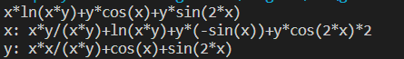

<br/>
<br/> 
<br/>
<br/> 
<br/>
<br/> 

# <center>Autograd for Algebraic Expressions</center>
<br/>

### <center>王傲哲 3220105775</center>
<br/>

##### <center>Date:2023-10-27</center>
<div STYLE="page-break-after: always;"></div>

## **Chapter 1:    Introduction**

* ### Problem Discription
> Given an infix expression composed of characters, we are expected to implement an automatic differentiation program for algebraic expressions. For each variable that appears in the expression, output an arithmetic expression that represents the derivative of the input algebraic expression with respect to that variable in the lexicographical order.
* ### Algorithm Introduction
> Simulation Algorithm: Simulation algorithms are a method of solving problems by simulating the behavior of a system or process. These algorithms are commonly used to simulate a variety of real-world situations in order to better understand, predict, or optimize the behavior of a system. Tools such as data structures, conditional statements, loops, random number generation, and mathematical functions can be used to implement simulation algorithm.

***

## **Chapter 2:    Algorithm Specification**
* ### The sketch of the main program
	> #### 1. Parsing Mathematical Expressions:
	> * The code reads a mathematical expression as input, tokenizes it, and builds an expression tree.
	> * It recognizes various mathematical functions like ln, log, sin, cos, tan, pow, and exp.
	> * It tokenizes variables, constants, and mathematical operators.
	> #### 2. Expression Tree Handling:
	> * The code creates a binary expression tree to represent the parsed mathematical expression.
	> * The tree structure consists of nodes with operator names and labels for mathematical functions.
	> * It uses two stacks (S1 and S2) to manage the tree construction.
	> #### 3. Automatic Differentiation:
	> * The code supports automatic differentiation for various mathematical functions.
	> * It computes the partial derivatives of the expression with respect to different variables.
	> * The Autograd function recursively traverses the expression tree, applying the chain rule and derivative rules for specific functions.
	> #### 4. Expression Simplification:
	> * The code simplifies the resulting derivative expressions using several rules.
	> * It removes unnecessary brackets and simplifies expressions with constants and 1s or 0s.
	> * It optimizes the representation of mathematical functions.
	> #### 5. Variable Sorting:
	> * The code sorts the variable names lexicographically and uses these variables in the derivative expressions.
	> #### 6. Output:
	> * The code prints the partial derivatives of the expression with respect to each variable.
	> * The resulting expressions are simplified and more human-readable.
* ### Generating mathematical expression tree for Autograd(Base):
    > The tree is formed by first traversing the given medium-order arithmetic expression through two stacks (one stack holds variables and constants, one stack holds operators), and combining the nodes according to the priority of the operators. Struct Node represents a node in a linked-list-based stack, and the Stack type is defined as a pointer to the struct Node, indicating that the stack is implemented using a linked list of nodes. Each node contains an array of characters op to represent an operator or operand, an integer lable indicating the label for mathematical functions, and three pointers (next, l, and r) pointing to the next node, the left child node, and the right child node, respectively. The functions Push, Pushnode, Pop, and cmb perform stack operations. Push is used to push a string onto the stack, Pushnode is used to push a node onto the stack, Pop is used to pop a node from the stack, and cmb is used to combine two stacks. It is easy to see that variables and constants are leaf nodes, and thus it is only necessary to start from the root of the tree and determine what is stored in the string of nodes: if it is an operator, then according to the corresponding mathematical rules of the left and right child nodes, if it is a variable or a constant, then according to the similarity or difference between the current variable and the object of the derivatives to output a 0 or a 1. Thus, recursive derivation on the child nodes can be derived from the partial derivatives of the entire expression.

	#### Pseudo Code
	```
	Function ParseMathExpression(expression):
		operandStack = Stack()  // To store operands
		operatorStack = Stack()  // To store operators

		while there are characters left in expression:
			ch = read next character
			if ch is a digit or a variable:
				operand = read the number or variable
				operandStack.push(CreateOperandNode(operand))
			else if ch is an operator:
				while operatorStack is not empty and the precedence of ch <= the precedence of the operator at the top of operatorStack:
					PerformOperationAndGenerateSubtree()  // Generate an expression subtree
				operatorStack.push(ch)
			else if ch is a left parenthesis:
				operatorStack.push(ch)
			else if ch is a right parenthesis:
				while the operator at the top of operatorStack is not a left parenthesis:
					PerformOperationAndGenerateSubtree()  // Generate an expression subtree
				operatorStack.pop()  // Pop the left parenthesis

		// Process any remaining operators
		while operatorStack is not empty:
			PerformOperationAndGenerateSubtree()  // Generate an expression subtree

		Return the top node of the operandStack as the entire expression tree

	Function CreateOperandNode(operand):
		Create a new tree node with operand as the value
		Return the new node

	Function PerformOperationAndGenerateSubtree:
		operator = operatorStack.pop()
		rightOperand = operandStack.pop()
		leftOperand = operandStack.pop()
		expressionTree = CreateOperatorNode(operator, leftOperand, rightOperand)
		operandStack.push(expressionTree)

	Function CreateOperatorNode(operator, left, right):
		Create a new tree node with operator as the value
		Set left and right as the left and right subtrees of the new node
		Return the new node
	```

<br/>

* ### Simplify(Bonus):
    > The simplifying operations in this program are: deleting unnecessary brackets, 0s and 1s and arranging the negative sign in a reasonable position.
	> #### Delete redundant brackets:
	> A stack is firstly created, and the operators in the expression are sequentially loaded onto the stack, the operators and their subscripts in the original expression are recorded as they are loaded onto the stack, and when a right parenthesis is encountered, the operator is continuously popped from the top of the stack until the top of the stack is the corresponding left parenthesis. According to the priority of "^" > "/" = "," > "*" > "-" > "+", the minimum priority of the operator inside the parentheses is recorded during the popping process, and if it is greater than or equal to the priority of the operators on both sides of the parentheses (if they exist) at the same time, the parentheses can be removed. Traverse the expression according to this rule. Note that before removing unnecessary parentheses, you need to modify the parentheses after the math function to other symbols to provide protection against accidental deletion, and then finally restore them.

	#### Pseudo Code
	```
	Procedure DeleteRedundantBrackets(expression):
		ReplaceProtectedBracketsAndMathFunctions(expression)
		Initialize an empty stack S
		For each character c in expression:
			If c is an operator ('(', ',', '+', '-', '*', '/', '^'):
				Push c onto the stack S along with its index in the expression
			Else If c is ')':
				minPriority = 10
				While the top of the stack S is not '(':
					Update minPriority if necessary based on operator precedence
					Pop the top of the stack S
				Calculate the left (l) and right (r) operator priorities
				If minPriority is greater than or equal to both l and r:
					Replace the ')' at the current index with '#'
			End If
		End For
		Remove '#' characters to delete redundant brackets
		RestoreProtectedBracketsAndMathFunctions(expression)

	Procedure ReplaceProtectedBracketsAndMathFunctions(expression):
		Replace protected brackets for ln, log, sin, cos, and tan functions
		Restore protected brackets and math functions for ln, log, sin, cos, and tan

	Procedure RestoreProtectedBracketsAndMathFunctions(expression):
		Replace '$' with '('
		Replace '`' with ')'
		Replace '??' with 'ln'
		Replace '~~~' with 'log'
		Replace '!!!' with 'sin'
		Replace '@@@' with 'cos'
		Replace '???' with 'tan'
	```
	> #### Delete redundant 0s:
	> First find the subscript of 0 in the string, assign it to two variables idl and idr. These two subscripts are traversed to the left and to the right until the scanning to "+", "-" or "(" (for idl) and ")" (for idr) to stop traversing, so as to determine the left and right ranges of the deleted portion of the string, and then finally cover the string can be done. In the process of deletion if the expression "()" case, it will be changed to "0", and then carry out an operation to delete unnecessary 0. Note that before deleting unnecessary zeros you need to modify the 0s in the constants to other characters to protect against accidental deletion, and then finally restore them.
	#### Pseudo Code
	```
	Procedure DeleteRedundantZeros(expression):
		While the expression contains "0":
			If the "0" is part of a constant:
				Protect it with another character ('$')
				Continue
			End If
			Set a flag to indicate changes (flag = 1)
			Find the left and right boundaries for the "0" (idl and idr)
			While idl >= 0 and not an operator ('+', '-' before '(') or '(':
				Skip nested brackets if necessary
				Move idl to the left
			End While
			While idr < length of expression and not an operator ('+', '-' before ')') or ')':
				Skip nested brackets if necessary
				Move idr to the right
			End While
			If both idl and idr are within bounds:
				If idl is '(':
					If idr is '+':
						Remove "0" and everything between idl and idr
					Else:
						Remove "0" and everything between idl and idr, including idr
				Else:
					Remove everything between idl and idr
			Else If idl < 0:
				If idr is '+':
					Remove "0" and everything after idr
				Else If idr is ')':
					Replace idr with '0', then remove "0" and everything before idr
				Else:
					Remove "0" and everything after idr
			Else If idr is beyond the end of the expression:
				Remove everything from idl to the end of the expression
			End If
		End While
		While the expression contains "()":
			Set a flag to indicate changes (flag = 1)
			Replace "()" with "0" and delete redundant "0"
		End While
		Replace protected "0" characters ('$') with "0"
	End Procedure
	```
	> #### Delete redundant 1s:
	> Find the subscript of 1 in the string in turn, determine whether its left side is a multiplication or division sign, if so it can be deleted together with 1; determine whether its right side is a multiplication sign and the left side is not a multiplication or division sign, if so it can be deleted together with 1. Note that before deleting unnecessary zeros you need to modify the 1s in the constants to other characters to protect against accidental deletion, and then finally restore them.
	#### Pseudo Code
	```
	Procedure DeleteRedundantOnes(expression):
		While the expression contains "1":
			If the "1" is part of a constant:
				Protect it with another character ('$')
				Continue
			End If
			Find the left and right boundaries for the "1" (idl and idr)
			If idl is preceded by '*' or '/', move it to the left
			If idr is immediately after idl and idr contains '*', move idr to the right
			If idl and idr are not adjacent:
				Set a flag to indicate changes (flag = 1)
				Remove everything between idl and idr
			Else:
				Protect the "1" with another character ('$')
			End If
		End While
		Replace protected "1" characters ('$') with "1"
	End Procedure
	```
    
<br/>

* ### Autograd with Mathematical Functions(Bonus):
    > In the process of generating the tree, if a mathematical function is recognized, the expression in the mathematical function is formed into a separate tree, and the root node of this subtree is labeled, so that the mathematical function can be recognized, the corresponding mathematical symbols added, and the corresponding rules of derivation applied in the subsequent derivation, and then this subtree is connected to the main tree. For the case of mathematical functions nested mathematical functions, this program, in order to avoid the original label being covered, treats the atomic tree as 1* (atomic tree) and records it as a new atomic tree, setting the label of the * node as the label corresponding to the current mathematical function.

	#### Pseudo Code
	```
	Procedure Autograd(expressionTree, independentVariable):
		if expressionTree is NULL:
			return

		operator = expressionTree.op
		label = expressionTree.label
		if label == 0:  // Leaf node or operation
			if operator is an arithmetic operator:
				left_derivative = Autograd(expressionTree.left, independentVariable)
				right_derivative = Autograd(expressionTree.right, independentVariable)
				
				if operator is '+':
					input('(')
					left_derivative
					input('+')
					right_derivative
					input(')')
				else if operator is '-':
					input('(')
					left_derivative
					input('-')
					right_derivative
					input(')')
				else if operator is '*':
					input('(')
					left_derivative
					input('*(')
					inorder(expressionTree.right)
					input(')+(')
					Autograd(expressionTree.left, independentVariable)
					input('*(')
					right_derivative
					input(')')
					input(')')
				else if operator is '/':
					input('((')
					left_derivative
					input('*(')
					inorder(expressionTree.right)
					input(')-(')
					Autograd(expressionTree.left, independentVariable)
					input('*(')
					right_derivative
					input('))/(')
					inorder(expressionTree.right)
					input(')^2')
				else if operator is '^':
					input('(')
					right_derivative
					input('*')
					inorder(expressionTree.left)
					input('^(')
					inorder(expressionTree.right)
					input(')')
				else:  // Derivative of other variables or constants
					input('0')
			else if operator is independentVariable:  // Derivative of the independent variable
				input('1')
			else:  // Handle other functions here
				// Define the derivative rules for specific functions
				// For example, if it's a sine function, apply the derivative rule for sine
				// For other functions, apply their respective derivative rules
		else:  // Mathematical function node
			// Handle mathematical functions separately
			// Apply the derivative rules for different functions
	```
***

## **Chapter 3:    Testing Results**
> * The correctness of this program can be demonstrated by the output of the derivation of the test samples.

> |Test Samples|Output Result|Test Judging and Instructions|
> |---|---|---|
> |a+b||correct|
> |a-b||correct|
> |a*b||correct|
> |a/b||correct </br> Final simplified result: </br> a: 1/b </br> b: (-a)/b^2|
> |a^b||correct|
> |ln(a)||correct|
> |log(a,b)||correct|
> |sin(a)||correct|
> |cos(a)||correct|
> |tan(a)||correct|
> |pow(a,b)||correct|
> |exp(a)||correct|
> |a+b^c*d||correct|
> |a+b^c*d||correct </br> Final simplified result: </br> a: 10 * b - 2^a / a^2 + 2^a * ln(2) / a </br> b: a*10|
> |xx^2 / xy * xy + a^a||correct </br> Final simplified result: </br> a: a^a*(1+ln(a)) </br> xx: 2*xx </br> xy: 0|
> |x*ln(y)||correct|
> |x * ln(x * y) + y * cos(x) + y * sin(2 * x)||correct|
> |log(a,b)/log(c,a)||correct|

## **Chapter 4:    Analysis and Comments**

> ### Complexity Analysis 
> #### The time complexity is O(N):
> * Expression parsing: The program first parses the input mathematical expression and builds the expression tree. The time complexity of the parsing process is proportional to the length of the expression, since each operator is only in and out of the stack twice, and each variable and constant is only in and out of the stack once. Assuming the length of the expression is N, the time complexity of this part is O(N).
> * Finding the partial derivatives: Computing the partial derivatives for each variable is a recursive operation. For each variable, the program needs to traverse the expression tree and generate a new expression. The time complexity of traversing the tree is proportional to the number of nodes in the tree. Assuming that the number of nodes in the tree is M (since the leaf nodes of the tree are variables or constants consisting of at least one character, so M < N), the time complexity of this part is O(M) for each variable. Assuming that the number of variables is K, the individual variables occupy the leaf nodes of the tree, which is much smaller than the total number of nodes in the tree, M, and even smaller than the length of the expression, N, and thus the total time complexity of this part of the process is O(M*K), which can be approximated as O(N).
> * Simplifying the expression: Simplifying the expression requires traversing the expression string, so the time complexity of this part is O(N).
> * The algorithm of bubbling sort is used to sort the variable names. Although the algorithm is O(N^2) time complexity, the number of variables K is much smaller than the length of the expression N, so the time complexity of this part does not have much effect on the total time complexity of the program.
> * In summary, the time complexity is O(N).
></br>
> #### The space complexity is O(N):
> * Expression Tree: The program needs to construct an expression tree to represent the input mathematical expression. The number of nodes M of the expression tree depends on the length of the expression N. Usually M < N, so the space complexity of this part is O(N).
> * Stack: The program uses a stack to store intermediate computation results and operators. The space complexity of the stack depends on the maximum depth of the stack, depending on the complexity of the expression, but its maximum depth does not exceed the length of the expression N. Therefore, the space complexity of this part can be approximated as O(N).
> * String Arrays: The program uses string arrays several times to store intermediate results and final output. The space complexity of the strings depends on the length of the strings, which does not exceed the length N of the original input math expression, so the space complexity of this part is O(N).
>

> #### Program Comments
> The main functions of this automatic derivation program include parsing mathematical expressions through a double stack, generating an abstract syntax tree for the expression, recursively deriving the expression through the tree, and simplifying the result of the derivation. On this basis, this program also adds part of the mathematical function processing, because the name of the mathematical function is not very convenient as a separate node in the tree, so I recorded the occurrence of mathematical functions by means of labels, which is regarded as a special class of operators, and the sub-tree under the labels is given special rules of derivation, which not only makes the structure of the tree more succinct, but also avoids the conflict between mathematical functions and the original principle of recursive derivation. This not only makes the tree structure more concise and clear, but also avoids the conflict between math functions and the original recursive principle.
***

## **Appendix:    Source Code (in C)**
```c
#include <stdio.h>

char v[100][100];//the names of variables
int vid=0;//the number of variables
char ep[1000];//mathematical expression
int flag;//determine if the expression has been simplified

int cmp(char a,char b)//set and compare the priority of operators: '^' > '*' = '/' > '+' = '-' > ',' > '('
{
	int wa,wb;
	if(a=='^')wa=3;
	else if(a=='*'||a=='/')wa=2;
	else if(a=='+'||a=='-')wa=1;
	else if(a==',')wa=0;
	else if(a=='(')wa=-1;
	if(b=='^')wb=3;
	else if(b=='*'||b=='/')wb=2;
	else if(b=='+'||b=='-')wb=1;
	else if(b==',')wb=0;
	else if(b=='(')wb=-1;
	return wa<=wb?1:0;
}

struct Node;
typedef struct Node* Stack;//set the struct of the tree & stack
struct Node
{
	char op[100];//the name of operators and variables
	int lable;//the lable of mathematical functions:ln--1 log--2 pow--3 exp--4 sin--5 cos--6 tan--7
	Stack next;//next node
	Stack l;//left child node
	Stack r;//right child node
};

void Push(char x[],Stack S)//push the string onto the stack
{
    Stack tmp=malloc(sizeof(struct Node));
	tmp->l=NULL;
	tmp->r=NULL;
    strcpy(tmp->op,x);
	tmp->lable=0;
    tmp->next=S->next;
    S->next=tmp;
}

void Pushnode(Stack x,Stack S)//push the node onto the stack
{
	x->next=S->next;
	S->next=x;
}

void Pop(Stack S)
{
    S->next=S->next->next;
}

void cmb(Stack S1,Stack S2)//combine S1 and S2
{
	Stack tmp=malloc(sizeof(struct Node));
	strcpy(tmp->op,S2->next->op);//take the top node of the S2 stack as the parent node
	Pop(S2);
	tmp->lable=0;
	tmp->r=S1->next;//take the top two nodes of the S1 stack as the right and left child nodes respectively
	if(S1->next)Pop(S1);
	tmp->l=S1->next;
	if(S1->next)Pop(S1);
	Pushnode(tmp,S1);//push the composed binary tree onto the S1 stack
}

int isdigit(char num[])//determine if the string consists of numbers
{
	for(int i=0;i<strlen(num);i++)
		if(!(num[i]>='0'&&num[i]<='9'))return 0;
	return 1;
}

int exist(char num[],char v[][100])//determine if the variable name has been recorded
{
	for(int i=0;i<vid;i++)
		if(strcmp(num,v[i])==0)return 1;
	return 0;
}

Stack bigmathtree(Stack t,int lable)//using 1 * (the nested math functions) to deal with the root node of subtree
{
	Stack T=malloc(sizeof(struct Node));
	strcpy(T->op,"*");
	T->r=t;
	T->lable=lable;
	T->l=malloc(sizeof(struct Node));
	strcpy(T->l->op,"1");
	T->l->lable=0;
	T->l->l=NULL;
	T->l->r=NULL;
	return T;
}

Stack mathtree()//generate separate subtree for expressions within mathematical functions
{
	Stack S1=malloc(sizeof(struct Node));//store variables and constants
	Stack S2=malloc(sizeof(struct Node));//store operators
	S1->next=NULL;
	S2->next=NULL;
	char s[100]="(";
	Push(s,S2);
	int bracket=1;//record whether nested brackets occur
	char ch=getchar();
	while(ch!=')'||bracket!=1)//read until the end of the math expression
	{
		if(ch>='a'&&ch<='z'||ch>='A'&&ch<='Z'||ch>='0'&&ch<='9')
		//read data in the same way as the following function createtree()
		{
			char num[100];
			int id=0;
			num[id++]=ch;
			ch=getchar();
			while(ch>='a'&&ch<='z'||ch>='A'&&ch<='Z'||ch>='0'&&ch<='9')
			{
				num[id++]=ch;
				ch=getchar();
			}
			num[id]='\0';

			if(strcmp(num,"ln")==0||strcmp(num,"log")==0||strcmp(num,"sin")==0||strcmp(num,"cos")==0||strcmp(num,"tan")==0||strcmp(num,"pow")==0||strcmp(num,"exp")==0)
			//if a mathematical function is scanned, a separate subtree is generated.
			{
				Stack t=mathtree();
				if(strcmp(num,"ln")==0)
				{
					if(t->lable!=0)//the case of nested mathematical functions
						t=bigmathtree(t,1);
					else t->lable=1;
				}
				else if(strcmp(num,"log")==0)
				{
					if(t->lable!=0)
						t=bigmathtree(t,2);
					else t->lable=2;
				}
				else if(strcmp(num,"pow")==0)
				{
					if(t->lable!=0)
						t=bigmathtree(t,3);
					else t->lable=3;
				}
				else if(strcmp(num,"exp")==0)
				{
					if(t->lable!=0)
						t=bigmathtree(t,4);
					else t->lable=4;
				}
				else if(strcmp(num,"sin")==0)
				{
					if(t->lable!=0)
						t=bigmathtree(t,5);
					else t->lable=5;
				}
				else if(strcmp(num,"cos")==0)
				{
					if(t->lable!=0)
						t=bigmathtree(t,6);
					else t->lable=6;
				}
				else if(strcmp(num,"tan")==0)
				{
					if(t->lable!=0)
						t=bigmathtree(t,7);
					else t->lable=7;
				}
				Pushnode(t,S1);
				ch=getchar();
				continue;
			}
			if(!isdigit(num)&&!exist(num,v))strcpy(v[vid++],num);//determine if the variable name has been recorded or is a constant
			Push(num,S1);
		}
		else
		{
			if(ch=='(')//push the left bracket onto the stack directly
			{
				char s[100];
				s[0]=ch;
				s[1]='\0';
				Push(s,S2);
				bracket++;
			}
			else if(ch==')')//find the corresponding left bracket
			{
				while(S2->next->op[0]!='(')
					cmb(S1,S2);//perform a combining operation before finding
				Pop(S2);
				bracket--;
			}
			else
			{
				while(S2->next&&cmp(ch,S2->next->op[0]))
				//if the priority of the new operator is less than or equal to the priority of the S2 top-of-stack operator, then the combine operation is performed.
					cmb(S1,S2);
				char s[100];
				s[0]=ch;
				s[1]='\0';
				Push(s,S2);
			}
			ch=getchar();
		}
	}
	while(S2->next->op[0]!='(')//read until the beginning of the math expression
		cmb(S1,S2);
	return S1->next;
}

Stack createtree()
{
	char ch=getchar();
	Stack S1=malloc(sizeof(struct Node));//store variables and constants
	Stack S2=malloc(sizeof(struct Node));//store operators
	S1->next=NULL;
	S2->next=NULL;
	while(ch!='\n')
	{
		if(ch>='a'&&ch<='z'||ch>='A'&&ch<='Z'||ch>='0'&&ch<='9')
		//The following comment details are similar to the above function mathtree().
		{
			char num[100];
			int id=0;
			num[id++]=ch;
			ch=getchar();
			while(ch>='a'&&ch<='z'||ch>='A'&&ch<='Z'||ch>='0'&&ch<='9')
			{
				num[id++]=ch;
				ch=getchar();
			}
			num[id]='\0';

			if(strcmp(num,"ln")==0||strcmp(num,"log")==0||strcmp(num,"sin")==0||strcmp(num,"cos")==0||strcmp(num,"tan")==0||strcmp(num,"pow")==0||strcmp(num,"exp")==0)
			{
				Stack t=mathtree();
				if(strcmp(num,"ln")==0)
				{
					if(t->lable!=0)
						t=bigmathtree(t,1);
					else t->lable=1;
				}
				else if(strcmp(num,"log")==0)
				{
					if(t->lable!=0)
						t=bigmathtree(t,2);
					else t->lable=2;
				}
				else if(strcmp(num,"pow")==0)
				{
					if(t->lable!=0)
						t=bigmathtree(t,3);
					else t->lable=3;
				}
				else if(strcmp(num,"exp")==0)
				{
					if(t->lable!=0)
						t=bigmathtree(t,4);
					else t->lable=4;
				}
				else if(strcmp(num,"sin")==0)
				{
					if(t->lable!=0)
						t=bigmathtree(t,5);
					else t->lable=5;
				}
				else if(strcmp(num,"cos")==0)
				{
					if(t->lable!=0)
						t=bigmathtree(t,6);
					else t->lable=6;
				}
				else if(strcmp(num,"tan")==0)
				{
					if(t->lable!=0)
						t=bigmathtree(t,7);
					else t->lable=7;
				}
				Pushnode(t,S1);
				ch=getchar();
				continue;
			}
			if(!isdigit(num)&&!exist(num,v))strcpy(v[vid++],num);
			Push(num,S1);
		}
		else
		{
			if(ch=='(')
			{
				char s[100];
				s[0]=ch;
				s[1]='\0';
				Push(s,S2);
			}
			else if(ch==')')
			{
				while(S2->next->op[0]!='(')
					cmb(S1,S2);
				Pop(S2);
			}
			else
			{
				while(S2->next&&cmp(ch,S2->next->op[0]))
					cmb(S1,S2);
				char s[100];
				s[0]=ch;
				s[1]='\0';
				Push(s,S2);
				
			}
			ch=getchar();
		}
	}
	while(S1->next->next)//read until there is only one node left in S1
		cmb(S1,S2);
	return S1->next;
}

void sort(char v[][100])//output the name of variables in the lexicographical order by bubbling sort
{
	for(int i=vid-1;i>0;i--)
	{
		int flag=0;
		for(int j=0;j<i;j++)
		{
			if(strcmp(v[j],v[j+1])>0)
			{
				char tmp[100];
				strcpy(tmp,v[j+1]);
				strcpy(v[j+1],v[j]);
				strcpy(v[j],tmp);
				flag=1;
			}
		}
		if(flag==0)return;//optimize sorting algorithm
	}
}

void input(char add[])//fill the expression string with characters
{
	strcat(ep,add);
}

void inorder(Stack T)//inorder traversal the current tree
{
	if(T)
	{
		if(T->lable==1)input("ln(");//add different prefixes and suffixes depending on the label
		if(T->lable==2)input("log(");
		if(T->lable==4)input("e^(");
		if(T->lable==5)input("sin(");
		if(T->lable==6)input("cos(");
		if(T->lable==7)input("tan(");
		inorder(T->l);
		input(T->op);
		inorder(T->r);
		if(T->lable!=0&&T->lable!=3)input(")");
	}
}

int find(char s[],char target[])//return the index of the first character of the substring in the original string
{
	return strlen(s)-strlen(strstr(s,target));
}

void delbracket(char s[])//delete redundant brackets
{
	//protect the brackets that come with math functions by replacing brackets with other characters
	while(strstr(s,"ln"))
	{
		int ids=find(s,"ln")+2;
		s[ids-2]='?';
		s[ids-1]='?';
		s[ids]='$';
		while(s[ids]!=')')
		{
			if(s[ids]=='(')//skip nested brackets
			{
				int count=1;
				ids++;
				while(s[ids]!=')'||count!=1)
				{
					if(s[ids]=='(')count++;
					if(s[ids]==')')count--;
					ids++;
				}
			}
			ids++;
		}
		s[ids]='`';
	}

	while(strstr(s,"log"))
	{
		int ids=find(s,"log")+3;
		s[ids-3]='~';
		s[ids-2]='~';
		s[ids-1]='~';
		s[ids]='$';
		while(s[ids]!=')')
		{
			if(s[ids]=='(')
			{
				int count=1;
				ids++;
				while(s[ids]!=')'||count!=1)
				{
					if(s[ids]=='(')count++;
					if(s[ids]==')')count--;
					ids++;
				}
			}
			ids++;
		}
		s[ids]='`';
	}

	while(strstr(s,"sin"))
	{
		int ids=find(s,"sin")+3;
		s[ids-3]='!';
		s[ids-2]='!';
		s[ids-1]='!';
		s[ids]='$';
		while(s[ids]!=')')
		{
			if(s[ids]=='(')
			{
				int count=1;
				ids++;
				while(s[ids]!=')'||count!=1)
				{
					if(s[ids]=='(')count++;
					if(s[ids]==')')count--;
					ids++;
				}
			}
			ids++;
		}
		s[ids]='`';
	}

	while(strstr(s,"cos"))
	{
		int ids=find(s,"cos")+3;
		s[ids-3]='@';
		s[ids-2]='@';
		s[ids-1]='@';
		s[ids]='$';
		while(s[ids]!=')')
		{
			if(s[ids]=='(')
			{
				int count=1;
				ids++;
				while(s[ids]!=')'||count!=1)
				{
					if(s[ids]=='(')count++;
					if(s[ids]==')')count--;
					ids++;
				}
			}
			ids++;
		}
		s[ids]='`';
	}

	while(strstr(s,"tan"))
	{
		int ids=find(s,"tan")+3;
		s[ids-3]=';';
		s[ids-2]=';';
		s[ids-1]=';';
		s[ids]='$';
		while(s[ids]!=')')
		{
			if(s[ids]=='(')
			{
				int count=1;
				ids++;
				while(s[ids]!=')'||count!=1)
				{
					if(s[ids]=='(')count++;
					if(s[ids]==')')count--;
					ids++;
				}
			}
			ids++;
		}
		s[ids]='`';
	}

	int level[256]={0};//priority correspondence table for deleting brackets
	level[',']=4;level['+']=1;level['-']=2;level['*']=3;level['/']=4;level['^']=5;
	struct stack
	{
		char c;
		int id;
		struct stack* next;
	};
	struct stack* S=malloc(sizeof(struct stack));
	S->next=NULL;
	for(int i=0;i<strlen(s);i++)
	{
		if(s[i]=='('||s[i]==','||s[i]=='+'||s[i]=='-'|| s[i]=='*'||s[i]=='/'||s[i]=='^')
		//operators are pushed onto the stack when encountered
		{
            struct stack* tmp=malloc(sizeof(struct stack));
			tmp->c=s[i];
			tmp->id=i;
			tmp->next=S->next;
			S->next=tmp;
        }
		else if(s[i]==')')
		{
			int min=10;
			while(S->next->c!='(')
			{
				//find the minimum operator precedence inside the brackets
				if(min>level[S->next->c])min=level[S->next->c];
				S->next=S->next->next;
			}
			int l=-1;
			int r=-1;
			if(i+1<strlen(s)&&s[i+1]!=')')
				r=level[s[i+1]];//record the priority of the operator to the left of the left bracket
			if(S->next->id-1>=0&&s[S->next->id-1]!='(')
				l=level[s[S->next->id-1]];//record the priority of the operator to the right of the right bracket
			if(min>=l&&min>=r)
			//if min is greater than or equal to both l and r, then the brackets can be removed.
			{
				s[i]=s[S->next->id]='#';
				flag=1;
			}
			else if((min==1&&r==2&&l<=1)||(min==3&&r==4&&l<=3))
			//special cases judgment
			{
                s[i]=s[S->next->id]='#';
				flag=1;
            }
            S->next=S->next->next;
		}
	}
	while(strstr(s,"#"))//delete redundant brackets
	{
		int id=find(s,"#");
		strcpy(s+id,s+1+id);
	}

	//restore protected brackets and math functions
	while(strstr(s,"$"))s[find(s,"$")]='(';
	while(strstr(s,"`"))s[find(s,"`")]=')';
	while(strstr(s,"??"))
	{
		int ids=find(s,"??");
		s[ids]='l';
		s[ids+1]='n';
	}
	while(strstr(s,"~~~"))
	{
		int ids=find(s,"~~~");
		s[ids]='l';
		s[ids+1]='o';
		s[ids+2]='g';
	}
	while(strstr(s,"!!!"))
	{
		int ids=find(s,"!!!");
		s[ids]='s';
		s[ids+1]='i';
		s[ids+2]='n';
	}
	while(strstr(s,"@@@"))
	{
		int ids=find(s,"@@@");
		s[ids]='c';
		s[ids+1]='o';
		s[ids+2]='s';
	}
	while(strstr(s,";;;"))
	{
		int ids=find(s,";;;");
		s[ids]='t';
		s[ids+1]='a';
		s[ids+2]='n';
	}
}

void del1(char s[])//delete redundant "1"
{
	while(strstr(s,"1"))
	{
		if(s[find(s,"1")+1]>='0'&&s[find(s,"1")+1]<='9'||s[find(s,"1")-1]>='0'&&s[find(s,"1")-1]<='9')
		//determine if the "1" here is part of a constant
		{
			s[find(s,"1")]='$';//if yes, protect it with other character
			continue;
		}

		//starting at "1", traverse left and right to determine where to delete.
		int idl=find(s,"1"),idr=find(s,"1")+1;
		if(idl-1>=0&&(s[idl-1]=='*'||s[idl-1]=='/'))idl--;
		if(idr<strlen(s)&&idl==idr-1&&s[idr]=='*')idr++;
		if(idl!=idr-1)
		{
			flag=1;
			strcpy(s+idl,s+idr);
		}
		else s[find(s,"1")]='$';
	}
	while(strstr(s,"$"))s[find(s,"$")]='1';//restore protected "1"
}

void del0(char s[])//delete redundant "0"
{
	while(strstr(s,"0"))
	{
		if(s[find(s,"0")+1]>='0'&&s[find(s,"0")+1]<='9'||s[find(s,"0")-1]>='0'&&s[find(s,"0")-1]<='9')
		//determine if the "0" here is part of a constant
		{
			s[find(s,"0")]='$';//if yes, protect it with other character
			continue;
		}

		flag=1;
		//starting at "0", traverse left and right to determine where to delete.
		int idl=find(s,"0"),idr=find(s,"0");
		while(idl>=0&&s[idl]!='+'&&(s[idl]!='-'||s[idl-1]=='(')&&s[idl]!='(')
		{
			if(s[idl]==')')//skip nested brackets
			{
				int count=1;
				idl--;
				while(s[idl]!='('||count!=1)
				{
					if(s[idl]==')')count++;
					if(s[idl]=='(')count--;
					idl--;
				}
			}	
			idl--;
		}
		while(idr<strlen(s)&&s[idr]!='+'&&(s[idr]!='-'||s[idr-1]=='(')&&s[idr]!=')')
		{
			if(s[idr]=='(')//skip nested brackets
			{
				int count=1;
				idr++;
				while(s[idr]!=')'||count!=1)
				{
					if(s[idr]=='(')count++;
					if(s[idr]==')')count--;
					idr++;
				}
			}
			idr++;
		}

		//categorize and discuss whether the characters at s[idl] and s[idr] are to be retained or not
		if(idl>=0&&idr<strlen(s))
		{
			if(s[idl]=='(')
			{
				if(s[idr]=='+')strcpy(s+idl+1,s+idr+1);
				else strcpy(s+idl+1,s+idr);//s[idr] is '-' or ')'
			}
			else strcpy(s+idl,s+idr);
		}
		else if(idl<0)
		{
			if(s[idr]=='+')strcpy(s,s+idr+1);
			else if(s[idr]==')')
			{
				s[idr]='0';
				strcpy(s,s+idr);
			}
			else strcpy(s,s+idr);
		}
		else if(idr>strlen(s)-1)strcpy(s+idl,"");
	}
	while(strstr(s,"()"))
	//replace "()" with "0" if it appears and delete redundant "0"
	{
		flag=1;
		int id=find(s,"()");
		strcpy(s+id,s+id+1);
		s[id]='0';
		del0(s);
	}
	while(strstr(s,"$"))s[find(s,"$")]='0';//restore protected "0"
}


void delas(char s[])//delete "+" in "+-"
{
	while(strstr(s,"+-"))
	{
		flag=1;
		int id=find(s,"+-");
		strcpy(s+id,s+id+1);
	}
}

void simplify(char s[])
{
	while(flag)//cyclize to the simplest form
	{
		flag=0;
		delbracket(s);
		del0(s);
		del1(s);
		delas(s);
	}
}

void Autograd(char s[],Stack T)//partially derive by tree
{
	if(T==NULL)return;
	char opr=T->op[0];
	char ops[100];
	strcpy(ops,T->op);
	if(T->lable==0)
	//determine if a math function is applied to the subtree here by label
	{
		if(opr=='+')
		{
			Autograd(s,T->l);
			input("+");
			Autograd(s,T->r);
		}
		else if(opr=='-')
		{
			Autograd(s,T->l);
			input("-");
			Autograd(s,T->r);
		}
		else if(opr=='*')
		{
			input("(");
			inorder(T->l);
			input(")*(");
			Autograd(s,T->r);
			input(")");
			input("+");
			input("(");
			Autograd(s,T->l);
			input(")*(");
			inorder(T->r);
			input(")");
		}
		else if(opr=='/')
		{
			input("((");
			Autograd(s,T->l);
			input(")*(");
			inorder(T->r);
			input(")");
			input("-");
			input("(");
			inorder(T->l);
			input(")*(");
			Autograd(s,T->r);
			input("))");
			input("/");
			input("(");
			inorder(T->r);
			input(")^2");
		}
		else if(opr=='^')
		{
			inorder(T->r);
			input("*");
			inorder(T->l);
			input("^(");
			inorder(T->r);
			input("-1)*(");
			Autograd(s,T->l);
			input(")+(");
			inorder(T);
			input(")*ln(");
			inorder(T->l);
			input(")*(");
			Autograd(s,T->r);
			input(")");
		}
		else if(strcmp(s,ops)==0)//The derivative of the independent variable with respect to itself is 1
		{
			input("1");
		}
		else//The derivative of other variables or constants with respect to the independent variable is 0
		{
			input("0");
		}
	}
	else
	{
		if(T->lable==1)//ln
		{
			T->lable=0;
			input("(");
			Autograd(s,T);
			input(")/(");
			inorder(T);
			input(")");
			T->lable=1;
		}
		else if(T->lable==2)//log
		{
			T->lable=0;
			input("(");
			Autograd(s,T->r);
			input(")/((");
			inorder(T->r);
			input(")*ln(");
			inorder(T->l);
			input("))-(");
			Autograd(s,T->l);
			input(")/((log(");
			inorder(T->r);
			input(",");
			inorder(T->l);
			input("))^2*(");
			inorder(T->l);
			input(")*ln(");
			inorder(T->r);
			input("))");
			T->lable=2;
		}
		else if(T->lable==3)//pow
		{
			T->lable=0;
			strcpy(T->op,"^");
			Autograd(s,T);
			T->lable=3;
		}
		else if(T->lable==4)//exp
		{
			T->lable=0;
			input("e^(");
			inorder(T);
			input(")*(");
			Autograd(s,T);
			input(")");
			T->lable=4;
		}
		else if(T->lable==5)//sin
		{
			T->lable=0;
			input("cos(");
			inorder(T);
			input(")*(");
			Autograd(s,T);
			input(")");
			T->lable=5;
		}
		else if(T->lable==6)//cos
		{
			T->lable=0;
			input("-sin(");
			inorder(T);
			input(")*(");
			Autograd(s,T);
			input(")");
			T->lable=6;
		}
		else if(T->lable==7)//tan
		{
			T->lable=0;
			input("(");
			Autograd(s,T);
			input(")/(");
			input("cos(");
			inorder(T);
			input("))^2");
			T->lable=7;
		}
	}
}

int main()
{
	Stack T=createtree();
	sort(v);
	for(int i=0;i<vid;i++)//output the partial derivatives of each variable in order
	{
		printf("%s: ",v[i]);
		strcpy(ep,"");
		Autograd(v[i],T);
		flag=1;
		simplify(ep);
		printf("%s\n",ep);//output the simplest expression
	}
	return 0;
}
```
***

## **Declaration**
__I hereby declare that all the work done in this project titled "cx2023_3220105775_P2.c" is of myindependent effort.__
