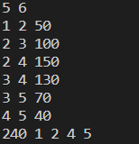

<br/>
<br/> 
<br/>
<br/> 
<br/>
<br/> 

# <center>The 2nd-shortest Path</center>
<br/>

### <center>王傲哲</center>
<br/>

##### <center>Date:2023-11-22</center>
<div STYLE="page-break-after: always;"></div>

## **Chapter 1:    Introduction**

* ### Problem Discription
> Given a directed graph with M vertices (1 ≤ M ≤ 1000) and N edges (1 ≤ N ≤ 5000), the vertices are numbered from 1 to M and each edge has its own positive length (1 ≤ length ≤ 5000). Output the length of the next shortest path from the 1st vertex to the Mth vertex, and the vertices' indices in order of the path.
* ### Algorithm Introduction
> Dijkstra Algorithm: It is a greedy algorithm for finding the shortest path in a directed or undirected graph. It iteratively determines the shortest path, initializing distances, selecting the node with the minimum distance, updating distances of neighboring nodes, and repeating these steps until the shortest paths to all nodes are determined. The algorithm yields the shortest paths and distances from a source node to other nodes. It requires non-negative weights in the graph.
***

## **Chapter 2:    Algorithm Specification**
* ### The sketch of the main program
	> #### 1. Structures:
	> * The __AdjSpot__ structure represents an adjacent vertex in the graph. It includes the identification of the adjacent vertex (__v__), the length of the edge (__l__), and a pointer to the next adjacent vertex (__next__).
	> * The __Graph__ structure represents a vertex in the graph. It contains a flag (__shortpath__) indicating whether the shortest or second shortest path is being considered, along with arrays __dist__ and __path__ to record the shortest and second shortest distances to the starting vertex and the last vertices in the shortest and second shortest paths.
	> * The __Element__ structure represents an element in the priority queue. It includes the vertex identification (__v__), the distance to the starting vertex (__dist__), and a path type flag (__path__) to distinguish between the shortest and second shortest paths.
	> * The __PQ__ structure is a priority queue based on a minimum binary heap, whose the top element is the unknown shortest path, thus making it more efficient to find the unknown shortest path.
	> #### 2. Functions:
	> * The __Insert__ function inserts an element into the min-heap, maintaining the properties of the priority queue.
	> * The __DeleteMin__ function deletes and returns the minimum element from the min-heap, performing a PercolateDown operation to maintain the heap property.
	> * The __Dijkstra__ function executes Dijkstra's algorithm, finding the shortest and second shortest paths from each vertex to the starting vertex.
	> * The __connect__ function generates an adjacency table, representing the structure of the graph.
	> * The __ReadGraph__ function reads input and generates the graph.
	> * The __Print2ndPath__ function prints the second shortest path from the starting point to the destination.
	> #### 3. Algorithm:
	> * Dijkstra algorithm is used to find the shortest and second shortest paths from a source vertex to all other vertices.
	> * Information about the shortest and second shortest paths for each vertex is maintained in the Map structure.
	> * The code employs a priority queue to find the vertex with the minimum distance.
	> #### 4. Main Program Logic:
	> * The __main__ function calls __ReadGraph__ to generate the graph, then executes Dijkstra's algorithm to find the shortest and second shortest paths.
	> * Finally, it calls __Print2ndPath__ to print the second shortest path from the starting point to the destination.
* ### Find the second shortest path by Dijkstra Algorithm:
	> #### 1. Initialization:
	> * The function begins by initializing the distance arrays and setting the distance of the starting vertex to itself as 0.
	> #### 2. Priority Queue (Heap) Initialization:
	> * A priority queue (implemented as a min-heap) is initialized and the starting vertex is inserted into the queue.
	> #### 3. Main Loop (Dijkstra's Algorithm):
	> * The main loop continues until the priority queue is empty.
	> * The vertex with the minimum distance is extracted from the priority queue.
	> * For each adjacent vertex, the function updates the shortest and second shortest paths if a shorter path is found.
	> * The updated vertices are inserted back into the priority queue.
	> #### 4. Path and Distance Updates:
	> * The function updates the distance and path information for each vertex based on the discovered paths during the algorithm execution.
	> #### 5. Shortest and Second Shortest Path Determination:
	> * The program distinguishes between the shortest and second shortest paths and records this information in the Map structure.
	#### Pseudo Code
	```
	function Dijkstra():
        // Initialization
        for each vertex i in Graph:
            Map[i].dist[0] = Map[i].dist[1] = INFINITY

        Map[1].dist[0] = 0  // The shortest path from the starting point to itself is 0

        // Initialize the priority queue (min heap)
        PriorityQueue H = createPriorityQueue()
        insert(H, Element(1, Map[1].dist[0], 0))

        // Main loop until the priority queue is empty
        while not isEmpty(H):
            // Extract the vertex with the minimum distance from the priority queue
            Element min = deleteMin(H)
            int minv = min.v     // Record the vertex with the unknown shortest path
            int minl = min.dist  // Record the distance of the unknown shortest path
            int minpath = min.path  // Record whether the unknown shortest path is the shortest or second shortest path

            // Iterate over all vertices adjacent to the current vertex
            for each adjacent vertex p of minv:
                // Update the shortest or second shortest paths of adjacent vertices
                if minl + length(minv, p) < Map[p].dist[0]:
                    Map[p].dist[1] = Map[p].dist[0]
                    Map[p].dist[0] = minl + length(minv, p)
                    Map[p].path[1] = Map[p].path[0]
                    Map[p].path[0] = minv
                    // Insert the updated vertex into the priority queue
                    insert(H, Element(p, Map[p].dist[0], 0))
                else if minl + length(minv, p) != Map[p].dist[0] and minl + length(minv, p) < Map[p].dist[1]:
                    Map[p].dist[1] = minl + length(minv, p)
                    Map[p].path[1] = minv
                    // Determine whether the second shortest path originates from the shortest path
                    if minpath == 1:
                        Map[p].shortpath = 1
                    else:
                        Map[p].shortpath = 0
                    // Insert the updated vertex into the priority queue
                    insert(H, Element(p, Map[p].dist[1], 1))

        // Free the allocated memory for the priority queue
        free(H)
	```
<br/>

## **Chapter 3:    Testing Results**
> * The correctness of this program can be demonstrated by the output of the derivation of the test samples.

> * Sample 1
> {width=40% height=auto} {width=40% height=auto}
> * Sample 2
> {width=40% height=auto} {width=47% height=auto}
> * Sample 3
> {width=44% height=auto} {width=40% height=auto}

## **Chapter 4:    Analysis and Comments**

> ### Complexity Analysis 
> #### The time complexity is _O_((_V_+_E_)log _V_ ):
> * Dijkstra Algorithm: The __Dijkstra__ function iterates over each vertex and its adjacent vertices, performing insertions and deletions in the priority queue. The inner loop operations take _O_(log _V_) time, and since it runs for each vertex and edge, the overall time complexity of the Dijkstra function is _O_((_V_ + _E_)log _V_).
> * Other Operations: The initialization of data structures and the final output generation take linear time relative to the number of vertices and edges.
> * In summary, the time complexity is _O_((_V_ + _E_)log _V_ ), where V is the number of vertices and E is the number of edges.
> </br>
> #### The space complexity is O(_V_+_E_):
> * Data Structures: The __Map__ array has a space complexity of O(_V_) as it stores information for each vertex. The priority queue __H__ has a space complexity of O(_V_) due to the __Element__ structure.
> * Adjacency Table: The space complexity of the adjacency table is O(_V_+_E_) since it needs to store information for each edge.
> * Other Variables: The space complexity for other variables and local variables is constant.
> * In summary, the space complexity is O(_V_+_E_), where V is the number of vertices and E is the number of edges.

> ### Program Comments
> This program efficiently applies Dijkstra's algorithm to find both the second shortest path in a weighted graph, which adopts the priority queue (min-heap) to efficiently finding the unknown shortest path. The detailed comments and clear variable names enhances readability. Record the shortest path is not difficult to achieve, the main difficulty of this program is to record the second shortest path, due to a vertex to a second shortest path either from the previous vertex of the second shortest path, or from the previous vertex of the shortest path, so only need to record the end point to the starting point of the second shortest path is from where to change into the shortest path, specifically record the transformation of the second shortest path, the other shortest paths are all from the shortest paths, in this way, the second shortest path can be derived. Overall, it is a commendable implementation showcasing proficiency in algorithmic design and C programming.
***

## **Appendix:    Source Code (in C)**
```c
#include <stdio.h>
#include <limits.h>
#include <stdlib.h>

#define MAXM 1000

int M,N;//M: the number of vertexs  N: the number of edges

struct AdjSpot{
	int v;//Adjacent Vertex
	int l;//Length of Edge
	struct AdjSpot *next;//Another Adjacent Vertexs
}*Spot[MAXM+1];//Adjacency Table

struct Graph{
	int shortpath;//Determine whether to take the shortest or second shortest path: value 1 for shortest, 0 for second shortest
	int dist[2];//Record the shortest and second shortest distances between the current vertex and the beginning vertex
	int path[2];//Record the last vertex of the shortest and second shortest paths
}Map[MAXM+1];

typedef struct{
	int v;//Vertex
	int dist;//the shortest or second shortest distance between the vertex and the beginning
	int path;//Record whether it's the shortest or second shortest path: value 0 for shorteset, 1 for second shortest
}Element;//the Element in the Priority Queue

struct PriorityQueue{
	int size;//the size of Priority Queue
	Element E[MAXM+1];
};
typedef struct PriorityQueue *PQ;

void Insert(int v,int dist,int path,PQ H)//Insert Element into the Min Heap
{
	for(int i=1;i<=H->size;i++)
	{
		if(H->E[i].v==v&&H->E[i].path==path)
		//If an element of the same type already exists in the min heap, replace it and PercolateUp.
		{
			while(H->E[i/2].dist>dist)
			{
				H->E[i]=H->E[i/2];
				i/=2;
			}
			H->E[i].v=v;
			H->E[i].dist=dist;
			H->E[i].path=path;
			return;
		}
	}
	int i=++H->size;//If not, add a new element to the end of the heap.
	while(H->E[i/2].dist>dist)
	{
		H->E[i]=H->E[i/2];
		i/=2;
	}
	H->E[i].v=v;
	H->E[i].dist=dist;
	H->E[i].path=path;
}

Element DeleteMin(PQ H)//Delete and return the top element and PercolateDown
{
	Element min=H->E[1];
	Element last=H->E[H->size--];
	int i,child;
	for(i=1;i*2<=H->size;i=child)
	{
		child=i*2;
		if(child!=H->size&&H->E[child].dist>H->E[child+1].dist)child++;
		if(last.dist>H->E[child].dist)H->E[i]=H->E[child];
		else break;
	}
	H->E[i]=last;
	return min;
}

void Dijkstra()//n is the number of vertexs
{
	for(int i=1;i<=M;i++)//Initialize all distances
		Map[i].dist[0]=Map[i].dist[1]=INT_MAX;
	Map[1].dist[0]=0;//The shortest path from the starting point to itself is 0
	PQ H=malloc(sizeof(struct PriorityQueue));
	H->size=0;
	H->E[0].dist=-1;//Initialize the Min Heap
	Insert(1,Map[1].dist[0],0,H);
	while(H->size)//Until the Min Heap is empty
	{
		Element min=DeleteMin(H);
		int minv=min.v;//Record the vertex with the unknown shortest path
		int minl=min.dist;//Record the distance of the unknown shortest path
		int minpath=min.path;//Record whether the unknown shortest path is the shortest or second shortest path
		struct AdjSpot *p=Spot[minv];
		while(p)//Iterate over all vertexs adjacent to this vertex to update their shortest or second shortest paths
		{
			if(minl+p->l<Map[p->v].dist[0])
			{
				Map[p->v].dist[1]=Map[p->v].dist[0];
				Map[p->v].dist[0]=minl+p->l;
				Map[p->v].path[1]=Map[p->v].path[0];
				Map[p->v].path[0]=minv;
				Insert(p->v,Map[p->v].dist[0],0,H);
			}
			else if(minl+p->l!=Map[p->v].dist[0]&&minl+p->l<Map[p->v].dist[1])
			{
				Map[p->v].dist[1]=minl+p->l;
				Map[p->v].path[1]=minv;
				if(minpath==1)Map[p->v].shortpath=1;
				else Map[p->v].shortpath=0;//If the second shortest path originates from the shortest path, then make shortpath=0
				Insert(p->v,Map[p->v].dist[1],1,H);
			}
			p=p->next;
		}
	}
	free(H);
}

void connect(int a,int b,int l)//Generate the Adjacency Table
{
	struct AdjSpot *pa;
	pa=malloc(sizeof(struct AdjSpot));
	pa->v=b;
	pa->l=l;
	pa->next=Spot[a];
	Spot[a]=pa;
}

void ReadGraph()//Generate the Graph
{
	scanf("%d %d",&M,&N);
	for(int i=1;i<=M;i++)Spot[i]=NULL;
	for(int i=0;i<N;i++)
	{
		int a,b,l;
		scanf("%d %d %d",&a,&b,&l);
		connect(a,b,l);
	}
}

void Print2ndPath()
{
	int path[2*N]; path[0]=M;//Record the second shortest path
	int numpath=1;//Record the number vertexs of the second shortest path
	int shortflag=0;//Record whether having gone from the shortest to the second shortest path once
	int spot=M;//Destination
	while(spot!=1)//Go back to the beginning
	{
		if(Map[spot].shortpath==1||shortflag)
		{
			path[numpath++]=Map[spot].path[0];
			spot=Map[spot].path[0];
		}
		else if(Map[spot].shortpath==0)
		{
			path[numpath++]=Map[spot].path[1];
			spot=Map[spot].path[1];
			shortflag=1;
		}
	}
	printf("%d",Map[M].dist[1]);
	for(int i=numpath-1;i>=0;i--)
	 	printf(" %d",path[i]);
}

int main()
{
	ReadGraph();
	Dijkstra();
	Print2ndPath();
	return 0;
}
```
***

## **Declaration**
__I hereby declare that all the work done in this project titled "cx2023_3220105775_P3.c" is of myindependent effort.__
