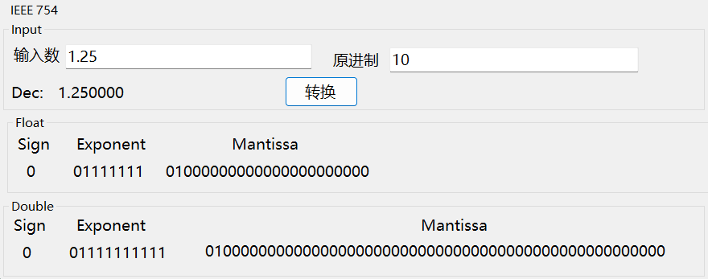

       

# 大程-MIPS模拟器

   

### 咋写都队

   

#### 任致霖 $~~$  秦际州
#### 王傲哲 $~~$  张航瑞

          

***
## Part 1 : 实现功能介绍
- ##### 汇编（MIPS->机器码）
- ##### 反汇编（机器码->MIPS)
- ##### 整数的表示、转换和运算
- ##### 浮点数的表示、转换和运算
- ##### 程序执行时的系统状态模拟（十五条汇编代码实现）

***

## Part 2 ：关键数据结构
- #### 汇编（MIPS->机器码）
  - ##### 结构体定义：
    -  `struct Instruction_R`: 用于表示 R 类型的 MIPS 指令结构体，包含 opcode、rs、rt、rd、shamt 和 funct 字段。
    - `struct Instruction_I`: 用于表示 I 类型的 MIPS 指令结构体，包含 opcode、rs、rt 和 immediate 字段。
    -  `struct Instruction_J`: 用于表示 J 类型的 MIPS 指令结构体，包含 opcode 和 address 字段。
  - ##### 枚举类型定义：
    - `enum In_R`: 枚举了 R 类型指令的操作码（opcode）。
    - `enum In_I`: 枚举了 I 类型指令的操作码。
    - `enum In_J`: 枚举了 J 类型指令的操作码。
  - ##### 全局变量定义:
    - `std::vector<std::string> my_label`: 用于存储标签。
    - `std::vector<std::string> my_pc`: 用于存储对应标签的 PC 地址。
    - `Label_Reg_Imme label_reg_imme`: 一个结构体实例，用于存储当前汇编指令的相关信息，包括寄存器和立即数的值，以及可能的标签。这个全局变量是用来给别的.cpp文件使用的
  - ##### 外部变量声明:
    - `extern Information R`:用于调用这个结构体中的PC（存储了当前指令的PC值），当发现某个指令前面有label，则会通过R.PC来找到当前label所指的PC地址，以便将label的PC地址联系起来，这些值还会存储到全局变量`label_reg_imme`中，以便其他文件里负责运行指令的功能在遇到jump指令时使用。
  - ##### 函数定义:
    - `bool is_R(const std::string& operator_str)`: 判断给定操作符是否为 R 类型指令。
    - `bool is_I(const std::string& operator_str)`: 判断给定操作符是否为 I 类型指令。
    - `bool is_J(const std::string& operator_str)`: 判断给定操作符是否为 J 类型指令。
    - `std::string deTobin(int decimal, int length)`: 将十进制数转换为指定长度的二进制字符串。
    -` void ass_R(std::string& instruction, const std::string& operator_str, std::string& binary)`: 处理 R 类型指令的汇编。
    - `void ass_I(std::string& instruction, const std::string& operator_str, std::string& binary)`: 处理 I 类型指令的汇编。
    - `void ass_J(std::string& instruction, const std::string& operator_str, std::string& binary)`: 处理 J 类型指令的汇编。
    - `void assemble(const std::string& instruction, std::string& binary)`: 汇编函数，根据输入的 MIPS 指令生成对应的机器码。
    - `std::string interface_ass(char str[])`: 接口函数，用于外部调用，传入 MIPS 指令，返回对应的机器码。
  - ##### 其他说明:
    - 在处理指令时，涉及到了对寄存器和标签的处理，以及一些错误处理（例如二进制字符串为 "++" 表示错误）。
- #### 反汇编（机器码->MIPS)
  - ##### registersdis 数组：
    - 用于存储 MIPS 寄存器的字符串表示，数组大小为 32。
    - 示例初始化：`"$zero", "$at", "$v0", ..., "$ra"`
- #### 整数的表示、转换和运算
  - ##### 类定义
    - `class Num`: 将整数及浮点数的表示、转换和运算相关函数抽象成一个整体，对`Int()`、`IntCompute()`函数进行封装。
  - ##### 函数定义
    - `std::string Int(char* number, int source, int target, int expand)`: 给定一个整数字符串，返回此数目标进制形式的字符串。
    - `std::string IntCompute(char* number1, char* number 2, int source, int target, int expand, int compute)`: 给定两个整数字符串，返回两数经过运算后的目标进制形式的字符串。
  - ##### 其他说明
    - 在处理给定数字时，如若输入数字不符合规范，会进行错误处理（例如输入非法的整数字符串会提示"Not a valid integer" 表示错误）。
- #### 浮点数的表示、转换和运算
  - ##### 类定义
    - `class Num`: 将整数及浮点数的表示、转换和运算相关函数抽象成一个整体，对`Dec()`、`Float()`、`Double()`、`DecCompute()`、`FloatCompute()`、`DoubleCompute()`函数进行封装。
  - ##### 函数定义
    - `std::string Dec(char* number, char* source)`: 给定一个浮点数字符串，返回此数十进制形式的字符串。
    - `std::string Float(char* number, int source)`: 给定一个浮点数字符串，返回此数float精度的IEEE 754字符串。
    - `std::string Double(char* number, int source)`: 给定一个浮点数字符串，返回此数double精度的IEEE 754字符串。
    - `std::string DecCompute(char* number1, char* number2, char* source, int compute)`: 给定两个浮点数字符串，返回两数经过运算后十进制形式的字符串。
    - `std::string FloatCompute(char* number1, char* number2, int source, int compute)`: 给定两个浮点数字符串，返回两数经过运算后的float精度的IEEE 754字符串。
    - `std::string DoubleCompute(char* number1, char* number2, int source, int compute)`: 给定两个浮点数字符串，返回两数经过运算后的double精度的IEEE 754字符串。
  - ##### 其他说明
    - 在处理给定数字时，如若输入数字不符合规范，会进行错误处理（例如输入非法的原进制字符串会提示"Not a valid source" 表示错误）。
- #### 程序执行时的系统状态模拟（十五条汇编代码实现）
  - ##### 结构体定义：
    - `struct Information`:在这个结构体中，记录了32个寄存器的的实时十六进制数据，以及PC指针所指向的地址，还有五个可视化的内存空间。
    - 寄存器：`string r[32]`:中记录了八位的十六进制寄存器的内容，作为全局变量实时显示。
    - 内存：`string memory[5]`:记录了内存之中的内容，一个里面记录了八位十六进制内容。
    - 指令指针：`string PC`:储存八位十六进制的PC地址。
  - ##### 全局变量定义：
    - `Information R`:确保全局都能读取寄存器中的信息
  - ##### 外部变量声明:
    - `Label_Reg_Imme label_reg_imme`:需要根据其中所存的关于指令的信息，把提供的信息传到对应的指令函数中去，完成指令到函数的对应。
  - ##### 函数定义 ： 
    - `static void pcadd(int k)`:完成对PC的加减操作。
    - `static string Int(char* number, int source, int target, int expand)`: 把k进制的字符串转化成m进制的字符串。
    - `static string complement(string k)`:将二进制字符串取补码。
    - `static void ADD(int rs, int rt, int rd)`:实现add指令。
    - `static void SUB(int rs, int rt, int rd)`:实现sub指令。
    - `static void OR(int rs, int rt, int rd)`:实现or指令。
    - `static void AND(int rs, int rt, int rd)`:实现and指令。
    - `static void NOR(int rs, int rt, int rd)`:实现nor指令。
    - `static void ADDI(int rs, int rt, int immediate)`:实现addi指令。
    - `static void SLL(int rs, int rt, int immediate)`:实现sll指令。
    - `static void SRL(int rs, int rt, int immediate)`:实现srl指令。
    - `static int BEQ(int rs, int rt, int immediate)`:实现beq指令。
    - `static int BNE(int rs, int rt, int immediate)`:实现ben指令。
    - `static void LW(int rs, int rt, int address)`:实现lw指令。
    - `static void SW(int rs, int rt, int address)`:实现sw指令。
    - `static int J(string address)`:实现j指令。
    - `static int JAL(string address)`:实现jal指令。
    - `static int JR(int rs)`:实现jr指令。
    - `static int interface_instruction(char str[])`:接口函数能够把指令传递到各个函数中去。

***

## Part 3 : 关键函数与算法分析
- #### 汇编（MIPS->机器码）
  - `void assemble(const std::string& instruction, std::string& binary)`
    - 参数：
      - `const std::string& instruction`: 输入的 MIPS 指令字符串。
      - `std::string& binary`: 存储翻译结果的字符串。
    - 过程：
      - 标签处理：
        - 通过查找冒号 :，检测指令中是否包含标签。
        - 如果存在标签，提取标签信息并存储到全局变量 `label_reg_imme.label` 中。
        - 同时将标签信息添加到全局变量 `my_label` 中，并将对应的 PC 地址添加到 my_pc 中。
      - 指令解析：
        - 通过查找空格分隔符，提取操作符（指令类型）和指令的其余部分。
        - 将操作符存储到局部变量 `operator_str` 中，将指令的其余部分存储到局部变量 `instruction_part` 中。
      - 指令类型判断和处理：
      - 调用相应的处理函数，根据指令类型进行进一步解析和处理。
      - 目前支持的指令类型有 R、I、J。
    - 错误处理：
      - 如果在处理过程中发现错误，将 `binary` 设置为 "++"，表示错误。
    - 处理剩余部分：
      - 在处理完指令类型之后，可能会有一些剩余的空格或其他字符，需要进行清理。
  - `void ass_R(std::string& instruction, const std::string& operator_str, std::string& binary)`
    - 参数：
      - `std::string& instruction`: 输入的 MIPS 指令字符串，经过主函数解析后的指令部分。
      - `const std::string& operator_str`: 操作符，表示指令的类型。
      - `std::string& binary`: 存储翻译结果的字符串。
    - 过程：
      - 操作符解析：
        - 根据操作符的不同，确定相应的操作码（`funct）。
        - 对于 `jr` 指令，设置` funct` 为 `jr` 对应的值，同时不涉及寄存器 `rt` 和 `shamt`。
      - 寄存器解析：
        - 解析指令中的寄存器信息，包括 `rd、rs、rt`。
        - 对于 `jr` 指令，只涉及 rs 寄存器。
      - 特殊处理（例如`sll、srl`指令）：
        - 针对 `sll` 和 `srl` 指令，解析移位量 `shamt`。
        - 对于其他指令，`shamt` 默认为 0。
      - 结果存储和转换为二进制：
        - 将解析得到的字段存储到全局变量 `label_reg_imme` 中。
        - 将指令信息转换为二进制字符串并存储于`binary`。
      - 错误处理：
        - 如果在处理过程中发现错误，将 `binary` 设置为 "++"，表示错误。
  - `void ass_I(std::string& instruction, const std::string& operator_str, std::string& binary)`
    - 参数：
      - `std::string& instruction`: 输入的 MIPS 指令字符串，经过主函数解析后的指令部分。
      - `const std::string& operator_str`: 操作符，表示指令的类型。
      - `std::string& binary`: 存储翻译结果的字符串。
    - 过程：
      - 操作符解析：
        - 根据操作符的不同，确定相应的操作码（ `opcode`）。
      - 寄存器解析：
        - 解析指令中的寄存器信息，包括 `rs、rt`。
        - 解析immediate
      - 特殊处理（例如 `lw、sw、lui` 指令）：
        - 针对 `lw` 和 `sw` 指令，指令格式不一样，存在括号。
        - 对于`lui`指令，只有一个寄存器。
      - 结果存储和转换为二进制：
        - 将解析得到的字段存储到全局变量 `label_reg_imme` 中。
        - 将指令信息转换为二进制字符串并存与binary。
      - 错误处理：
        - 如果在处理过程中发现错误，将 `binary` 设置为 "++"，表示错误。
  - `void ass_J(std::string& instruction, const std::string& operator_str, std::string& binary)`
    - 参数：
      - `std::string& instruction`: 输入的 MIPS 指令字符串，经过主函数解析后的指令部分。
      - `const std::string& operator_str`: 操作符，表示指令的类型。
      - `std::string& binary`: 存储翻译结果的字符串。
    - 过程：
      - 操作符解析：
        - 根据操作符的不同，确定相应的操作码（`opcode`）。
      - 跳转地址解析：
        - 解析指令中的跳转地址，分为两种情况：
        - 如果是数字直接表示的地址，将其解析为整数。
        - 如果是标签，查找标签在程序中的地址。
      - 结果存储和转换为二进制：
        - 将解析得到的字段存储到全局变量 `label_reg_imme` 中。
        - 将指令信息转换为二进制字符串并存入binary。
      - 错误处理：
        - 如果在处理过程中发现错误，将 `binary` 设置为 "++"，表示错误。
- #### 反汇编（机器码->MIPS)
  - `binToDec（寄存器专用）
    - 输入：该函数接受一个二进制字符串 `binary` 作为输入。
    - 输出：函数返回一个整数，表示输入二进制字符串的十进制值。
    - 算法：
      - `int length = binary.length();`：计算二进制字符串的长度。
      - `int decimal = 0;`：初始化十进制值为零。
    - 函数遍历二进制字符串的每个字符：
      - 如果当前字符是 '1'，则将 2^(当前位置) 加到 `decimal` 值上。
      - 如果当前字符不是 '0' 或 '1'，则返回 -1，表示输入字符串包含非法字符。
      - 如果最终得到的十进制值小于 0 或大于 31，则返回 -1，表示超出了寄存器有效范围。
  -` binToDec2`
    - 输入：该函数接受一个二进制字符串 `binary` 作为输入。
    - 输出：函数返回一个整数，表示输入二进制字符串的十进制值。
    - 算法：
      - `int length = binary.length();`：计算二进制字符串的长度。
      - `int decimal = 0;`：初始化十进制值为零。
    - 函数遍历二进制字符串的每个字符：
      - 如果当前字符是 '1'，则将 2^(当前位置) 加到 decimal 值上。
      - 如果当前字符不是 '0' 或 '1'，则返回 -1，表示输入字符串包含非法字符。
  - `int decimal = 0;`
    - 输入：该函数接受一个机器码的二进制字符串 `binary` 作为输入。
    - 输出：函数通过引用参数 `std::string& instruction` 返回相应的 MIPS 指令。
    - 算法：
      - `std::string opcode = binary.substr(0, 6);`：提取二进制字符串的前 6 位，表示操作码（`opcode`）。
      - 如果操作码是 "000000"，则调用 `dis_R` 函数处理 `R` 类型指令，否则调用 `dis_I_J` 处理 `I` 和 `J` 类型指令。
    - `dis_R` 函数调用：
      - `dis_R` 函数负责处理 `R` 类型指令，根据二进制字符串的功能码（`func`）判断具体指令类型，并解析出寄存器等相关信息，然后构建相应的 MIPS 指令字符串。
      - 构建的指令字符串存储在 `instruction` 参数中。
    - `dis_I_J` 函数调用：
      - `dis_I_J` 函数处理 I 和 J 类型指令，根据二进制字符串的操作码（`opcode）判断具体指令类型，解析出寄存器、立即数、或地址等相关信息，然后构建相应的 MIPS 指令字符串。
      - 构建的指令字符串存储在 `instruction` 参数中。
    - 返回：函数并没有显式的返回值，而是通过引用参数返回解析出的` MIPS `指令字符串。
  - `dis_R`
    - 输入：函数接受一个 `R` 类型指令的机器码二进制字符串 binary 和一个引用参数 `std::string& instruction`。
    - 输出：解析后的 MIPS 指令字符串存储在 `instruction` 参数中。
    - 功能码解析：函数首先从输入的二进制字符串中提取功能码 `func`，根据不同的功能码判断具体的指令类型。
    - 寄存器解析：根据不同的指令类型，解析出相应的寄存器信息。函数调用了 `binToDec` 函数将二进制寄存器号转换为十进制寄存器号，然后使用寄存器号获取寄存器的字符串表示。
    - 指令字符串构建：根据解析出的信息构建相应的 `MIPS` 指令字符串。
    - 错误处理：在解析过程中，如果出现寄存器解析错误或者未知的功能码，函数将指令字符串置为 "++"，表示解析失败。
  - `dis_I_J`
    - 输入：函数接受一个 I 类型或 J 类型指令的机器码二进制字符串 `binary` 和一个引用参数 `std::string& instruction`。
    - 输出：解析后的 `MIPS 指令字符串存储在 `instruction` 参数中。
    - 功能码解析：函数首先从输入的二进制字符串中提取功能码 `func`，根据不同的功能码判断具体的指令类型。
    - 寄存器和立即数解析：根据不同的指令类型，解析出相应的寄存器和立即数信息。函数调用了 `binToDec` 函数将二进制寄存器号转换为十进制寄存器号，然后使用寄存器号获取寄存器的字符串表示。
    - 指令字符串构建：根据解析出的信息构建相应的 `MIPS` 指令字符串。
    - 错误处理：在解析过程中，如果出现寄存器解析错误或者未知的功能码，函数将指令字符串置为 "++"，表示解析失败。
- #### 整数的表示、转换和运算
  - `std::string Int(char* number, int source, int target, int expand)`
    - 参数：
      - `char* number`: 输入的整数字符串。
      - `int source`: 待转换数的进制。
      - `int target`: 转换的目标进制。
      - `int expand`: 拓展的位数（0则不拓展）。
    - 过程：
      - 数字处理：
        - 通过`strtol()`检查是否为规范的整数字符串，若不是则返回报错字符串"Not a valid integer"，若是则将原进制的整数转换为十进制并保存。
        - 通过`itoa()`将该十进制的整数转换成目标进制。
      - 拓展位：
        - 由`expand`是否为0判断是否需要拓展位。
        - 通过比较当前字符串的长度与目标位数，进行补位或删位，返回最终修改后的字符串。
  - `std::string IntCompute(char* number1, char* number 2, int source, int target, int expand, int compute)`
    - 参数：
      - `char* number1`: 输入的第一个整数字符串。
      - `char* number2`: 输入的第二个整数字符串
      - `int source`: 待转换数的进制。
      - `int target`: 转换的目标进制。
      - `int expand`: 拓展的位数（0则不拓展）。
      - `int compute`: 进行的运算（1：+；2：-；3：*；4：/）。
    - 过程：
      - 进制转换：
        - 将两个整数转换为十进制。
      - 运算：
        - 直接对十进制的数进行运算。
        - 将运算结果转换为字符串并返回。
- #### 浮点数的表示、转换和运算
  - `std::string Dec(char* number, char* source)`
    - 参数：
      - `char* number`: 输入的整数字符串。
      - `char* source`: 待转换数的进制或形式（可为数字也可为"float"或"double"（IEEE 754形式））。
    - 过程：
      - 进制或形式判断：
        - 如果`source`为"float"或"double"，则根据IEEE754的标准将number转换为十进制浮点数。
        - 如果`source`为数字，则根据普通带小数点的数字的标准将其转换为十进制浮点数。
      - 转换：
        - `source`为"float"或"double"：根据 x=(−1)^S×(1.M)×2^E 转换为十进制浮点数。
        - `source`为数字：根据 x += 当前位数字*pow(原进制,当前位数) 转换为十进制浮点数。
  - `std::string Float(char* number, int source)`
    - 参数：
      - `char* number`: 输入的浮点数字符串。
      - `int source`: 待转换数的进制。
    - 过程：
      - 进制转换：
        - 将浮点数转换为二进制，以小数点分隔整数部分和小数部分。
      - IEEE 754：
        - 根据原浮点数是否带负号确定符号位。
        - 移动小数点至第一个‘1’处，根据小数点需要移动的位数确定指数。
        - 小数点右边的剩余部分为尾数，并在尾数末补位至23位。
        - 返回完整的IEEE 754 Float浮点数字符串。
  - `std::string Double(char* number, int source)`
    - 参数：
      - `char* number`: 输入的浮点数字符串。
      - `int source`: 待转换数的进制。
    - 过程：
      - 进制转换：
        - 将浮点数转换为二进制，以小数点分隔整数部分和小数部分。
      - IEEE 754：
        - 根据原浮点数是否带负号确定符号位。
        - 移动小数点至第一个‘1’处，根据小数点需要移动的位数确定指数。
        - 小数点右边的剩余部分为尾数，并在尾数末补位至23位。
        - 返回完整的IEEE 754 Double浮点数字符串。
  - `std::string DecCompute(char* number1, char* number2, char* source, int compute)`
    - 参数：
      - `char* number1`: 输入的第一个浮点数字符串。
      - `char* number2`: 输入的第二个浮点数字符串
      - `char* source`: 待转换数的进制或形式（可为数字也可为"float"或"double"（IEEE 754形式））。
      - `int compute`: 进行的运算（1：+；2：-；3：*；4：/）。
    - 过程：
      - 进制转换：
        - 将两个浮点数转换为十进制。
      - 运算：
        - 直接对十进制的数进行运算。
        - 将运算结果转换为字符串并返回。
  - `std::string FloatCompute(char* number1, char* number2, char* source, int compute)`
    - 参数：
      - `char* number1`: 输入的第一个浮点数字符串。
      - `char* number2`: 输入的第二个浮点数字符串
      - `int source`: 待转换数的进制。
      - `int compute`: 进行的运算（1：+；2：-；3：*；4：/）。
    - 过程：
      - 进制转换：
        - 将两个浮点数转换为十进制。
      - 运算：
        - 直接对十进制的数进行运算。
        - 将运算结果转换为字符串，并返回将其转换为IEEE 754 Float形式的浮点数字符串。
  - `std::string DoubleCompute(char* number1, char* number2, char* source, int compute)`
    - 参数：
      - `char* number1`: 输入的第一个浮点数字符串。
      - `char* number2`: 输入的第二个浮点数字符串
      - `int source`: 待转换数的进制。
      - `int compute`: 进行的运算（1：+；2：-；3：*；4：/）。
    - 过程：
      - 进制转换：
        - 将两个浮点数转换为十进制。
      - 运算：
        - 直接对十进制的数进行运算。
        - 将运算结果转换为字符串，并返回将其转换为IEEE 754 Double形式的浮点数字符串。
- #### 程序执行时的系统状态模拟（十五条汇编代码实现）
  - `Instructions::pcadd(int k)`
    - 输入：八位十六进制的PC地址
    - 返回：是将全局变量中的PC更新
    - 算法：将十六进制先转化为十进制的`unsigned int `类型之后再进行计算，在之后转为十六进制存在PC中，其中的转化都可以使用自带的库函数。
  - `static string complement(string k)`
    - 输入： 把32位进制输入
    - 输出： 输出32位二进制的补码
    - 算法：暴力将三十二位遍历，把所有的位数都取反，再转为十进制再加一，最后转化为二进制输出。
  - `static void ADD(int rs, int rt, int rd)`
    - 输入：按照指令的顺序输入寄存器的编号
    - 返回：直接将计算结果更新到目标寄存器中
    - 算法：还是将所存的十六进制的内容转化为十进制，在进行计算之后再次转化。
  - `static void OR(int rs, int rt, int rd)`
    - 输入：按照指令的顺序输入寄存器的编号
    - 返回：直接将计算结果更新到目标寄存器中
    - 算法，直接转化为二进制，按照位数对比进行逻辑运算，再转化为十六进制
  - `static void SLL(int rs, int rt, int immediate)`
    - 输入：按照指令的顺序输入寄存器的编号
    - 返回：直接将计算结果更新到目标寄存器中
    - 算法：也是将寄存器中存的数据转化位十进制再进行计算位移，最后再存回寄存器中去。
  - static void LW(int rs, int rt, int address)
    - 输入：按照指令的顺序输入寄存器的编号
    - 返回：直接将计算结果更新到目标寄存器中
    - 算法：根据规则计算出所取的地址，再惊醒取值操作，存入寄存器中
  - `static int J(string address)`
    - 输入：按照指令的顺序输入寄存器的编号
    - 输出：输出相对跳转的指令数
    - 算法：与PC做差再除以4计算出需要跳转到指令数，最后将PC更新
  - ##### 实现了十五条指令，但是许多指令间的算法思路等重复度还是比较高，在此只选出几个有代表的指令简单介绍。

***

## Part 4：多文件组织结构
- #### UI项目
  - 说明
    - 该项目为C#项目，主要功能为图形化界面的构建和相关功能函数的调用，输出.exe可执行文件。
  - 关键文件
    - 窗口文件：
      - `Form1.cs`: 主菜单窗口，用于功能选择。
      - `Form2.cs`: 汇编器窗口，有编辑、汇编\反汇编、运行、虚拟寄存器及内存显示功能。
      - `Form3.cs`: 整数转换窗口，有整数进制转换功能。
      - `Form4.cs`:浮点数转换窗口，有浮点数转换功能。
      - `Form5.cs`:浮点数运算窗口，有浮点数运算功能。
      - `Form6.cs`：整数运算窗口，有整数运算和进制转换功能。
- #### C++项目
  - 说明
    - 该项目为C++项目，主要功能为程序核心算法和接口，输出.dll动态库文件。
  - 关键文件
    - 核心算法文件：
      - `assemble.h,assemble.cpp`: 汇编核心算法文件。
      - `disassemble.h,disassemble.cpp`:反汇编核心算法文件。
      - `Instructions.h,Instructions.cpp`:运行核心算法文件。
      - `num.h,num.cpp`:整数及浮点数转换及运算核心算法文件。
    - 接口文件：
      - `assembleinterface.h,assembleinterface.cpp`: 汇编及反汇编接口文件。
      - `Instructionsinterface.h,instructionsinterface.cpp`:运行接口文件。
      - `numinterface.h,numinterface.cpp`: 整数及浮点数转换及运算接口文件。
      - `Source.def`: dll模块定义文件
  

***

## Part 5：部署方法及使用说明
- #### 部署方法
  - 直接运行
    - 在项目文件夹UI\bin\Debug\net6.0-windows中有.exe可执行文件，可直接点击使用。需注意该文件依赖其文件夹中其他文件运行，如有需求须整体移动。
  - 编译运行
    - 使用装有“.NET桌面开发”及“ASP.NET和Web开发”功能的vs2022打开“mips编译器.sln”文件，直接点击编译运行，生成目录为.\UI\bin\Debug\net6.0-windows。
- #### 使用说明
  - 汇编器窗口
    - 编辑：
      - 编辑界面使用DataGridView控件，需按行输入MIPS码或机器码
    - 汇编/反汇编：
      - 点击相应菜单选项进行相应操作，需注意该功能会自动删除相应列的空白行
    - 运行：
      - 点击运行菜单开始从头逐步执行，下一步菜单为执行PC指向的命令，停止为停止执行，遇到错误语句会弹窗警告并停止运行
  - 其他数据操作窗口:
    - 按提示输入数据点击转换/运算即可。

***

## Part 6: 测试样例
- #### 汇编与反汇编
  - 
  - 
  - 
  - 
- #### 整数的表示、转换和运算
  - 转换
  {width=40% height=auto} {width=40% height=auto}
  - 运算
  {width=40% height=auto} {width=40% height=auto}
- #### 浮点数的表示、转换和运算
  - 转换
  {width=70% height=auto} {width=70% height=auto}
  - 运算
  {width=70% height=auto} {width=70% height=auto}
- #### 程序执行时的系统状态模拟（十五条汇编代码实现）
  - 
  - 
  - 