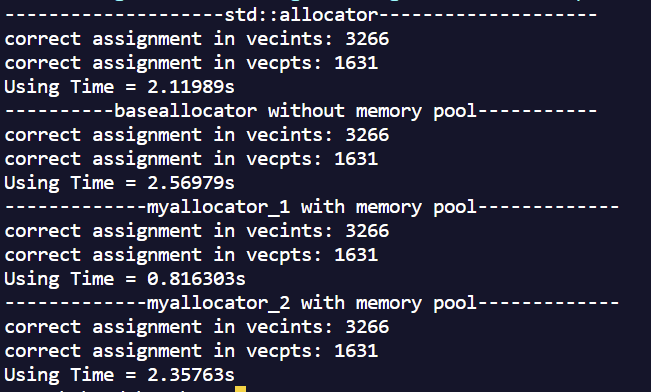
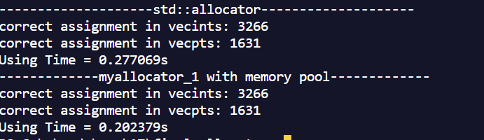
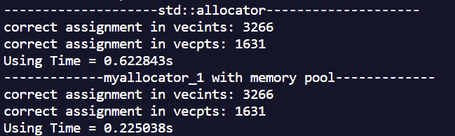

## Assignment 007 STL allocator + memory pool

#### 1. The team members
**王傲哲(Wang Aozhe) 3220105775**
**秦际州(Qin Jizhou) 3220105929**
#### 2. The method description
##### 一共实现了三种的分配器其中两种使用了手写的内存池，将在本部分进行解释说明：
- **`norallocator.h`**
  - 实现方式简单，直接使用malloc分配内存，free释放内存
  - 主要是用于对使用内存池的分配器的对比
- **`myallocator_1.h`** 
  - 实现思路： 预先分配一块大的内存池`List* pool[NUM_OF_POOL]`，并将其分割成固定大小的块。它为每个块大小类别维护单独的链表（`List*`），从而实现高效的分配和释放并减少内存的碎片化。
    - 链表池（`pool`）：
      - `List* pool[NUM_OF_POOL]:` 一个链表数组，其中每个链表表示特定大小类别的空闲内存块池。
      - 每个链表（`List*`）表示特定块大小的池。数组的索引对应于块大小类别。
    - 内存块表示（`union List`）：
      - `union List { union List *next_pool; char not_empty[1]; };`
      - 该union用于表示链表中的节点。
      - `next_pool` 是指向链表中下一个节点的指针。
      - `not_empty` 是大小为1的虚构数组，确保每个节点占用至少一个字节。
    - 内存池指针：
      - `char *start, *end:` 表示整个内存池的起始和结束指针。
      - `size_t total_size:` 已分配内存池的总大小。
  - 分配思路： 当发出内存分配请求时，分配器会检查请求的大小是否在内存池	的最大限制（`MAX`）内。如果请求的大小大于 `MAX`，则使用标准 `malloc` 来分配内存并返回。否则根据请求的大小计算合适的内存块的索引（`poolindex` 函数），获取对应内存池的头指针`curpool`。如果内存池非空，从内存池头部取出一个节点 `result`，更新内存池头指针；如果内存池为空，则分配新的块，并返回第一个节点（`supplement` 函数）。
  - 释放思路： 当释放内存时，分配器检查释放的内存大小是否超过内存池的最大限制（`MAX`），如果是，则使用标准`free`释放内存。否则计算释放的内存块大小对应的内存池索引(`poolindex`函数)，获取对应内存池的头指针`curpool`，将释放的内存块节点`q`插入到内存池的头部，更新内存池头指针。
  - 内存池优化：
    - 池效率： 内存池被划分为固定大小的块（`BLOCK`）。不同的块大小在单独的链表中管理，以优化不同大小的分配。
    - 减少内存碎片化： 通过使用内存池，对于频繁分配和释放小对象的情况，通过链表可将已释放的内存块链接在一起，从而减少内存碎片化。
    - 二级分配： 对于大于池的大小（`MAX`）的内存请求，分配器使用标准的 `malloc` 来处理；否则使用内存池来快速处理小的内存请求。
    - 编译优化： 在编译选项中加入`-O3`使编译器自动对程序性能进行优化，如内联函数嵌入、循环展开、函数调用优化等。同时在`supplement` 函数的主要循环前加入`#pragma simd`指令，对其后循环代码自动向量化，实现并行计算从而优化性能。
- **`myallocator_2.h`**
  - 这个是最先实现的内存池，但是暴露出了一些缺点：
    - 运行的时间较长，但是相比于 `noraml` 的直接 `malloc` 和 `free` 还是有提升。但是与`std::allocator`相比还是会慢。
  - 之后将简单分析一下实现思路：
    - 
    - 实现思路： 通过指针将`POOL`相连，每一次内存不足时都会`malloc`一个 `POOL` ，`POOL`中有该固定大小的`block` 对于内存分配便是以`block`为单位进行分配。
    - `POOL` : 在每个`POOL`的头会有一个结构体指向下一个POOL，当每次内存不足时，会`malloc` 一个`POOL`连入链表中。
    - `block` :在内存池内存分配中的最小单位，只能分配`block`大小的倍数个内存，对于不是倍数的内存大小会分配大于内存大小的最小倍数个`block`。在其中每一段无论空闲还是已经被分配，都会在这一段的头用一个结构体记录这段连续内存的大小以及是否被分配的状态。
    - 分配思路：在分配时，如果所需内存大小小于`POOL`的大小，将`pool`遍历在其中找到一块连续的比所需要大小大的内存区间，将区间分成两段，一段返回给用户用于存储，另一端变成一段小的连续的空闲空间，若是没有找到，则会开一段新的`POOL`连接进链表，并在其中按上述方法分配一段内存。如果大于的话，直接用`malloc`进行分配。
    - 释放思路：根据所传回的内存地址找到所在的`POOL`，在对`block`块进行遍历找到其中对应的地址，将那段连续地址的头结构体中的状态改为空闲。在对比相邻两块的连续内存块，看是否能够合并。
#### 3. The evaluation
**一共使用了两个测试**
- 第一个是将所有实现的分配器同时测试，通过运行时间来比较性能的好坏
  - 
  - 分析：在`debuge`下进行编译运行
    - 第一个使用内存池的分配器时最快的，快于了库中的分配器
    - 直接进行内存分配的分配器是最慢
    - 第二个使用内存池的分配器，快于直接分配内存的分配器的速度，仍慢于库中的分配器
- 第二个是单独测试最终的分配器，并对其进一步加速
  - 
  - 
  - 分析：多次测试下可以发现myallocator_1分配器性能是优于库中的分配器的。

#### 4. C++ standard version
	#define __cplusplus 201402L