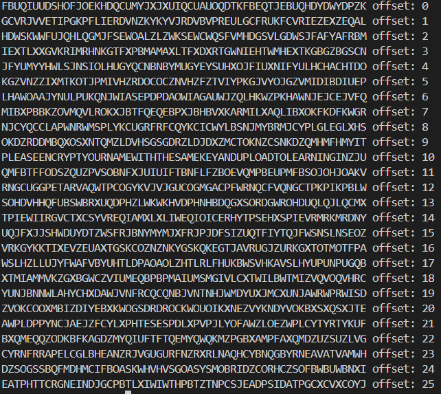
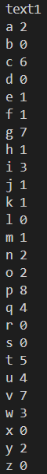
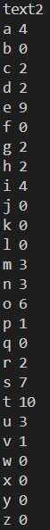
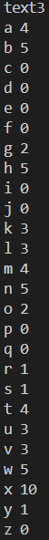
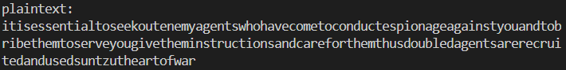

# <center>Password Cracking</center>

## 1.Caeser

#### Ciphertext:
	FBUQIUUDSHOFJOEKHDQCUMYJXJXUIQCUAUOQDTKFBEQTJEBUQHDYDWYDPZK
#### 破解思路：
	穷举26种移位方式，判断语义是否通顺从而找到明文
	
* 代码实现：
```cpp
  #include <iostream>
  #include <string>

  using namespace std;

  int main()
  {
  	//decrypt
  	string c;
  	cin >> c;
  	for (int i = 0; i < 26; i++)
  	{
  		for (int j = 0; j < c.size(); j++)
  		{
  			if(c[j]>='a'&&c[j]<='z')
  				cout << static_cast<char>((c[j] - 'a' + i) % 26 + 'a');
  			else if(c[j]>='A'&&c[j]<='Z')
  				cout << static_cast<char>((c[j] - 'A' + i) % 26 + 'A');
  		}
  		cout << " offset: " << i << endl;
  	}
return 0;
  }
```
* 输出：
  

#### Plaintext：
	PLEASEENCRYPTYOURNAMEWITHTHESAMEKEYANDUPLOADTOLEARNINGINZJU

#### 分析：
	可知当offset为10时，依据明文句意"Please encrypt your name with the same key and upload to Learning In ZJU"————继续加密我的姓名"WANGAOZHE"
	解密是+offset = 10，则加密相反为-offset = -10，即+offset = -10 % 26 = 16
* 加密代码实现
```cpp
#include <iostream>
#include <string>

using namespace std;

int main()
{
//encrypt
	string p = "WANGAOZHE";
	for (int i = 0; i < p.size(); i++)
		cout << static_cast<char>((p[i] - 'A' + 16) % 26 + 'A');
	return 0;
}
```
* 输出：MQDWQEPXU


## 2.Vigenère

#### Ciphertext: 
	ktbueluegvitnthuexmonveggmrcgxptlyhhjaogchoemqchpdnetxupbqntietiabpsmaoncnwvoutiugtagmmqsxtvxaoniiogtagmbpsmtuvvihpstpdvcrxhokvhxotawswquunewcgxptlcrxtevtubvewcnwwsxfsnptswtagakvoyyak

#### 破解思路：
	观察可得："ue"分别相隔3、6个字符重复出现，"ao"相隔24个字符重复出现，"gta"相隔18个字符重复出现，"sw"相隔36个字符重复出现，"ew"相隔18个字符重复出现。
	以上间隔长度都有公因数3，因此有理由猜测密钥长度为3，由于对于密钥中相同位置的字母的密文偏移量相同，从而考虑将以上密文分为三份，再对三份密文分别采用频率分析法和Caesar算法进行解密。

#### 频率分析
* 代码实现：
```cpp
#include <iostream>
#include <string>

using namespace std;

void Frequency(string c)
{
	int fq[256] = {0};
	for (int i = 0; i < c.size(); i++)
		fq[c[i]]++;
	for (int i = 'a'; i <= 'z'; i++)
		cout<<static_cast<char>(i)<<" "<<fq[i]<<endl;
}

int main()
{
	string c, t1, t2, t3;
	t1 = t2 = t3 = "";
	cin >> c;
	for (int i = 0; i < c.size(); i++)
	{
		if(i%3==0)
			t1 += c[i];
		else if(i%3==1)
			t2 += c[i];
		else
			t3 += c[i];
	}
	cout << "text1" << endl;
	Frequency(t1);/
	cout << "text2" << endl;	
	Frequency(t2);
	cout << "text3" << endl;	
	Frequency(t3);
	return 0;
} 
```

* 输出：
    

* 分析：  

	  可知26个英文字母在句子中出现的频率最高的五个字母依次为'e'、't'、'a'、'o'、'i'，通过分别找到文本中出现频率最高的五个字母，综合比较其相较于正常频率最高的五个字母的偏移，从而推导出密钥与其对应的Caesar算法offset的明文。
	  以text1(在原密文中第1、4、7...位的字母组成的文本)为例，可知其中频率最高的五个字母依次为'p'、'v'、'g'、'c'、't'，不难发现'e'与'g'、't'与'v'、'a'与'c'偏移量均为2，故可推测密钥的第一个字母相较于'a'偏移量为2，即为'c'。
	  同理对text2分析，可知其中频率最高的五个字母依次为't'、'e'、's'、'o'、'a'/'i'，不难发现这与正常句子中频率最高的五个字母几乎完全相同，即偏移量为0，故可推测密钥的第二个字母相较于'a'的偏移量为0，即为'a'。
	  同理对text3分析，可知其中频率最高的五个字母依次为'x'、'b'、'h'、'n'、'w',其中'x'的频率为其余四个字母的两倍，且除'x'外其它字母频率相差不大，故可推测密文中'x'对应的明文为最高频率的字母——'e'，即偏移量为19，故可推测密钥的第二个字母相较于'a'的偏移量为19，即为't'。
	  综上可知，密钥为"cat"，分别对三份文本使用Caesar算法即可倒推出明文。

#### 倒推明文
* 代码实现
```cpp
#include <iostream>
#include <string>

using namespace std;

int main()
{
	string c, t1, t2, t3;
	t1 = t2 = t3 = "";
	cin >> c;
	for (int i = 0; i < c.size(); i++)
	{
		if (i % 3 == 0)
			t1 += c[i];
		else if (i % 3 == 1)
			t2 += c[i];
		else
			t3 += c[i];
	}
	string p = "";
	for (int i = 0; i < c.size(); i++)
	{
		if (i % 3 == 0)
			p += (t1[i / 3] - 'a' + 24) % 26 + 'a';
		else if (i % 3 == 1)
			p += t2[i / 3];
		else
			p += (t3[i / 3] - 'a' + 7) % 26 + 'a';
	}
	cout << "plaintext: " << endl << p;
	return 0;
}
```
* 输出：
	
#### Plaintext：
	  it is essential to seek out enemy agents who have come to conduct espionage against you and to bribe them to serve you give them instructions and care for them thus doubled agents are recruited and used suntzu the art of war

## 3.Unknwon

#### Ciphertext:

      MAL TIRRUEZF CR MAL RKZYIOL EX MAL OIY UAE RICF "MAL ACWALRM DYEUPLFWL CR ME DYEU MAIM UL IZL RKZZEKYFLF GH OHRMLZH"

#### 破解思路：
	  由密文内容可推测密文保留了明文中单词的间隔，即密文中各单词的长度与原文一致，可考虑通过字母的替换来解密。
* 由频率分析法得密文中频率最高的五个字母依次为'L'、'M'/'R'、'A'、'E'。
* 由于正常语句中频率最高的五个字母为'E'、'T'、'A'、'O'、'I'，且"MAL"反复出现，可推测其对应明文为"THE",即'M'->'T'，'A'->'H'，'L'->'E'。
  	
	  此时明文为：THE ???????? ?? THE ??????E ?? THE ??? ?H? ???? "THE H??HE?T ?????E??E ?? T? ???? TH?T ?E ??E ????????E? ?? ???TE??"
* 上述部分明文中含有"T?"、"TH?T"、"?E"等此类短小或马上可破解的单词,例如"T?"中'?'对应密文为'E'，由于'E'在密文中的频率较高，'O'在明文中的频率也较高，且"TO"刚好可以组成英文单词，故合理推测'E'->'O'。同理推测"TH?T"->"THAT"、"?E"->"WE"、"?HO"->"WHO",即'I'->'A'、'U'->'W'。从而进一步推测"??E"->"A?E"->"ARE"，即'Z'->'R'。

	  此时明文为：THE ?A??WOR? ?? THE ??R?A?E O? THE ?A? WHO ?A?? "THE H??HE?T ??OW?E??E ?? TO ??OW THAT WE ARE ??RRO???E? ?? ???TER?"
* 观察密文可知"DYEU"出现了两次且不是同一个词，故猜测"DYEU"为一个词根，根据已破解的部分明文的语境可推测"DYEU"->"??OW"->"KNOW"，即'D'->'K'、'Y'->'N'；进一步推测"KNOW?E??E"->"KNOWLEDGE"，即'P'->'L'、'F'->'D'、'W'->'G'。

	  此时明文为：THE ?A??WORD ?? THE ??RNA?E O? THE ?AN WHO ?A?D "THE H?GHE?T KNOWLEDGE ?? TO KNOW THAT WE ARE ??RRO?NDED ?? ???TER?"
* 观察密文可知"CR"单独出现两次，且"TIRRUEZF"->"?A??WORD"，结合已知明文意可推测"CR"->"IS"、"?A??WORD"->"PASSWORD"，即'C'->'I'、'R'->'S'、'T'->'P'。

	  此时明文为：THE PASSWORD IS THE S?RNA?E O? THE ?AN WHO SAID "THE HIGHEST KNOWLEDGE IS TO KNOW THAT WE ARE S?RRO?NDED ?? ??STER?"
* 通过已知明文可得"S?RNA?E"("RKZYIOL")与"?AN"("OIY")含有共同的未知字母'O'，不难发现若'O'->'M'可同时使两词通顺，即"S?RNA?E"->"SURNAME"、"?AN"->"MAN"，即'K'->'U'、'O'->'M'。

	  此时明文为：THE PASSWORD IS THE SURNAME O? THE MAN WHO SAID "THE HIGHEST KNOWLEDGE IS TO KNOW THAT WE ARE SURRO?NDED ?? ??STER?"
* 通过已知明文，结合语境可推测"O?"->"OF"、"SURRO?NDED"->"SURROUNDED"、"??"->"BY"，即'X'->'F'、'K'->'U'、'G'->'B'、'H'->'Y'。进而可知"??STER?"->"?YSTERY"，推测得"?YSTERY"->"MYSTERY"，即'O'->'M'。

	  此时明文为：THE PASSWORD IS THE SURNAME OF THE MAN WHO SAID "THE HIGHEST KNOWLEDGE IS TO KNOW THAT WE ARE SURROUNDED BY MYSTERY"
#### Plaintext：
	THE PASSWORD IS THE SURNAME OF THE MAN WHO SAID "THE HIGHEST KNOWLEDGE IS TO KNOW THAT WE ARE SURROUNDED BY MYSTERY"

|明文|a|b|c|d|e|f|g|h|i|j|k|l|m|n|o|p|q|r|s|t|u|v|w|x|y|z|
|---|---|---|---|---|---|---|---|---|---|---|---|---|---|---|---|---|---|---|---|---|---|---|---|---|---|---|
|密文|i|g| |f|l|x|w|a|c| |d|p| |y|e|t| |z|r|m|k| |u| |h| |

#### Password：
	Schweitzer(the surname of Albert Schweitzer)