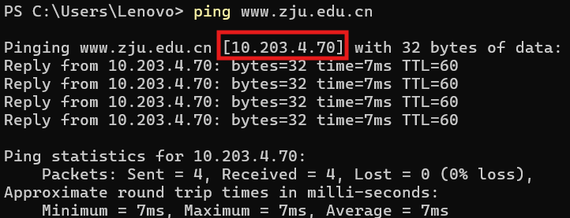

# <center>Using Wireshark</center>
<center>王傲哲 3220105775</center>

## 1.`WireShark`安装
	[网络数据包捕获和分析库](https://www.winpcap.org)
	[WireShark软件主体](https://www.wireshark.org)

## 2.抓包操作
### 2.1 获取主机IP
```
ping www.zju.edu.cn
```


### 2.2 设置过滤器
* 添加新的捕获过滤器，只接受主机ip为`10.203.4.70`的网络数据包


### 2.3 捕获数据包
* 选取刚刚添加的过滤器，点击`开始`捕获数据包


* 浏览器访问<https://www.zju.edu.cn>，返回`WireShark`查看捕获的数据包并保存捕获文件

（为避免数据包冗余，尽量独立使用同一账号下的校网进行抓包，否则可能出现多个源端口号，影响数据包观察与分析）

## 3.结果分析

### 3.1 TCP协议
标志位基本信息：
	
	SYN 表示建立连接， FIN 表示关闭连接， ACK 表示响应， PSH 表示有 DATA 数据传输， RST 表示连接重置。
* 第一次握手：
  * 客户端发送一个 TCP ，标志位为`SYN`，代表客户端请求建立连接。
  * `Seq` = 0 ：初始建立连接值为0，数据包的相对序列号从0开始，表示当前还没有发送数据
  * `Ack` = 0 ：初始建立连接值为0，已经收到包的数量，表示当前没有接收到数据

* 第二次握手：
  * 服务器发回确认包, 标志位为`SYN`，`ACK`，代表确认的回馈连接。
  * `Seq` = 0 ：初始建立值为0，表示当前还没有发送数据
  * `Ack` = 1 ：将确认码设置为客户端的初始化序列号(`ISN`)加1，即0+1=1。表示当前端成功接收的数据位数。

* 第三次握手：
  * 客户端再次发送确认包，标志位为`ACK`，代表已经收到记录。
  * `Seq` = 1 ：表示当前已经发送1个数据
  * `Ack` = 1 : 将确认码设置为服务端的初始化序列号加1，即0+1=1。表示当前端成功接收的数据位数。


### 3.2 TLS协议
目标服务器由 HTTPS 加密，未经设置的 WireShark 无法抓取 HTTPS 的数据包。而 HTTPS 实现安全通信的方法就是在原有的 HTTP 层与 TCP 之间加入 TLS/SSL 协议层，因此除对 TCP 协议的分析外同时也加入了对 TLS 协议的分析。
* 第一次握手：
  * 客户端发送`Client Hello`消息，跟服务器打招呼，其中主要携带：
    * 客户端的 TLS 版本号（`Version`）、
    * 客户端生成的随机数（`Client Random`）、
    * 客户端支持的加密套件列表（`Cipher Suites`）

* 第二次握手：
  * 服务器收到客户端的`Client Hello`消息后，首先回复`Server Hello`消息，其中主要包括：
    * 服务器确认支持客户端的 TLS 版本（`Version`）、
    * 服务器生成的随机数（`Server Random`）、
	* 服务器从客户端发来的加密套件列表中选出一个最合适的加密组合（`Cipher Suite`）

  * 服务器为了证明身份，随后会给客户端发送数字证书，即`Certificate`消息，数字证书中主要包括：
    * CA机构的签名(`signature`)：CA机构对证书的签名，即先对证书的明文部分计算哈希值（SHA256）得到摘要后，再用CA机构本身的私钥对摘要进行加密（RSA），得到CA机构的签名
    * 服务器的信息(`subject`)：例如证书拥有者（服务器）的域名等信息
    * 服务器的公钥(`subjectPublicKeyInfo`)：CA机构为这个服务器颁发的公钥，也是在后续TLS第三次握手时客户端所使用的公钥

	（只有证书的签名部分是使用RSA私钥加密的，其他的服务器信息、服务器公钥部分作为证书的正文数据，是明文的）
  * 最后，服务器发送`Server Hello Done`消息给客户端，通知客户端第二次握手中服务器的所有消息都已发送完毕

* 第三次握手：
  * `Client key Exchange`：客户端使用操作系统内置的CA机构的公钥对证书进行解密，得到`数据原文`及摘要值`H1`，然后客户端使用与CA机构相同的摘要算法（散列算法，SHA或MD5）对数据原文进行计算得到摘要值`H2`，比较H1与H2，若完全相同则说明证书合法且未被篡改，从而拿到服务器的RSA公钥。随后，客户端生成TLS握手过程中的第三个随机数，并用服务器的公钥对其加密，通过 `Client Key Exchange`消息发给服务器
  * `Change Cipher Spec`：客户端使用所拥有的三个随机数生成对称加密的密钥，客户端通过`Change Cipher Spec`消息将对称密钥发送给服务器，并通知服务器开始使用对称加密的方式进行通信。
  * `Encrypted Handshake Message`：最后，客户端发送`Encrypted Handshake Message`消息，将之前发送的所有数据做成摘要，使用对称密钥加密，供服务器验证之前握手过程中的数据是否被篡改。

* 第四次握手：
  * `Change Cipher Spec`：服务器在收到客户端的`Client Key Exchange`消息后，使用RSA私钥对其解密，得到客户端生成的第三个随机数，从而服务器也拥有了与客户端相同的三个随机数，服务器使用这三个随机数计算对称密钥，将计算后的结果通过`Change Cipher Spec`消息返回给客户端（RSA非对称加密的作用就在于对第三个随机数的加密，前面两个随机数都是公开的）
  * `Encrypted Handshake Message`：服务器通过`Encrypted Handshake Message`消息将之前握手过程中的数据生成的摘要使用对称密钥加密后发给客户端，供客户端进行验证。

* 至此 TLS 四次握手结束，可进行客户端与服务器之间的安全交互：
